# Statistics & Evaluation Metrics for Machine Learning
### A Self-Sufficient Reference for Students & ML Engineers

> **How to use this document:** Every topic follows the same pattern — a layman's analogy first, then a real-world use case, then the rigorous technical detail an ML engineer is actually expected to know. Every chart on this page was generated from real (or clearly-labeled synthetic) data using Python — nothing here is a stock image.

---

## Part A — Foundational Statistics

## A.1 Probability Distributions

### Layman's term
Imagine you're a teacher who has graded thousands of exams over the years. If you plotted every score you've ever given on a wall, most scores would pile up in the middle (around the average), with fewer really high and really low scores tapering off at the edges. That "shape of how common each value is" — the pile in the middle, the tapering edges — is a **probability distribution**. It's simply the answer to "if I pick a random value from this data, what's it *likely* to look like?"

### Analogy
Think of it like a dartboard after 10,000 throws by an average player. Most darts cluster near the center-ish area (not necessarily bullseye), fewer land further out, and almost none land at the very edge. The "heat map" of where darts landed *is* a distribution.

### Use case
A ride-sharing app studies "trip duration" across a city. Most trips take 10-25 minutes (the cluster), a few take over an hour (the rare tail). Knowing this shape lets the app set fair pricing, flag suspiciously long trips, and decide how to prepare its ETA model.

### Detailed technical explanation

A distribution can be **symmetric** (like the Normal/Gaussian distribution) or **skewed** (like income, house prices, or transaction amounts, which have a long tail of high values). This shape is not decoration — it drives concrete engineering decisions:

- **Feature transformation**: A right-skewed feature is typically log-transformed (`log(x+1)`) or Box-Cox transformed before feeding it to a linear model, because linear models and many statistical tests assume roughly-Normal, symmetric inputs. Skipping this step is one of the most common beginner mistakes.
- **Choosing the loss function**: Assuming your errors are Normally distributed is exactly what justifies using Mean Squared Error (MSE) as a loss function. If your target is a *count* (e.g., "number of support tickets per day," which follows a Poisson distribution and can never be negative), a Poisson Regression is the statistically correct tool — not ordinary linear regression.
- **Outlier / anomaly detection**: Under a Normal distribution, the famous **68-95-99.7 rule** says 68% of data falls within 1 standard deviation of the mean, 95% within 2, and 99.7% within 3. Anything beyond 3 standard deviations is a statistical outlier worth investigating (fraud systems use exactly this kind of rule).
- **Class imbalance is a distribution problem too**: The distribution of your *target label* (e.g., 99% "not fraud" vs. 1% "fraud") determines your entire evaluation strategy — see Part B.

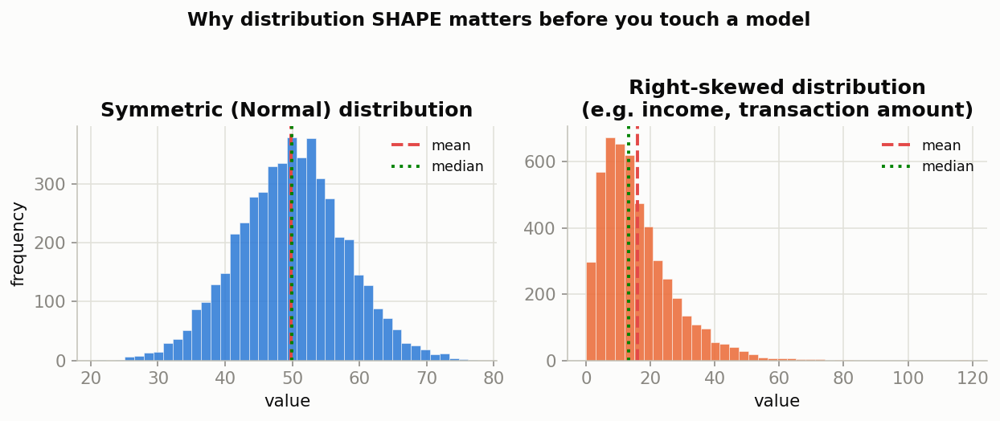

*Left: a Normal (symmetric) distribution — mean and median are nearly identical. Right: a right-skewed distribution — notice the mean is pulled to the right of the median by the long tail. This single visual difference should change how you preprocess a feature.*

---

## A.2 Mean, Median & Variance (Center and Spread)

### Layman's term
If ten friends tell you their commute times, the **mean** is what you get by adding them all up and splitting evenly — the "fair share" number. The **median** is simply the one in the middle if you lined everyone up shortest-to-longest commute. **Variance** answers a completely different question: not "what's typical?" but "how much do people disagree from that typical value?"

### Analogy
Picture two classrooms that both average 75% on a test. In Classroom A, everyone scored between 70-80% (low variance — very consistent). In Classroom B, half the class scored 100% and half scored 50% (high variance — wildly inconsistent), yet the *average* looks identical. The mean alone lies to you about what's really happening; variance tells the rest of the story.

### Use case
A hospital measures patient wait times. The mean might be a reassuring "20 minutes," but if variance is huge (some patients wait 2 minutes, others wait 2 hours), the *experience* is inconsistent and needs fixing — a fact the mean alone completely hides.

### Detailed technical explanation

- **Missing value imputation** (see Part D): Fill numeric gaps with the **mean** only when the feature is roughly symmetric and outlier-free. Use the **median** for skewed features (like salary) because the median is *robust* — a few extreme values barely move it, while the mean gets dragged around.
- **Feature scaling / Standardization**: The most common scaler in ML, **Z-score standardization**, is built directly from these two numbers:

  ```
  z = (x - mean) / standard_deviation
  ```

  This recenters a feature to mean 0, std 1 — essential for distance-based algorithms (KNN, K-Means, SVM) and gradient-descent algorithms (neural nets, logistic regression), which are all sensitive to the raw scale of inputs.
- **Variance as a literal feature-selection filter**: A "Variance Threshold" step drops any column whose variance is near zero — a feature that's almost always the same value can't help a model tell classes apart.
- **The Interquartile Range (IQR)**, a spread measure related to variance, is the statistical basis of outlier detection via boxplots: anything below `Q1 − 1.5×IQR` or above `Q3 + 1.5×IQR` is flagged as an outlier.
- Variance is also the literal namesake of the **Bias-Variance Tradeoff** (Part E) — the single most important diagnostic concept in ML.

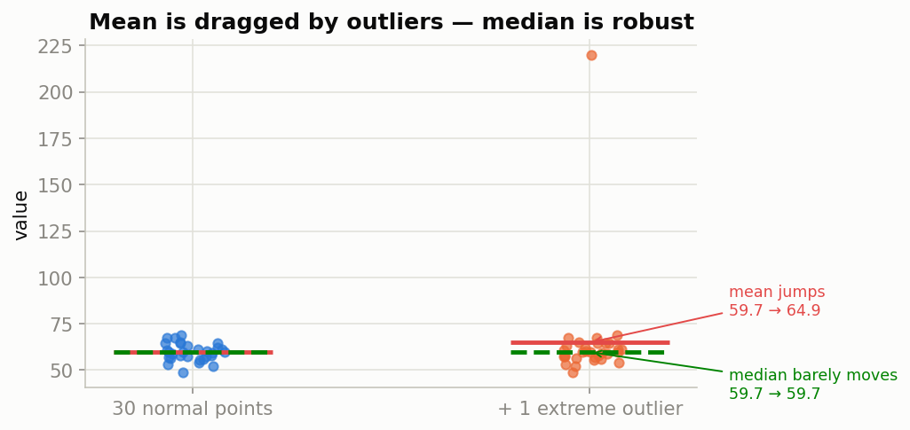

*Adding just ONE extreme outlier (220) to 30 normal data points drags the mean far away, while the median barely moves. This is why median imputation and median-based scaling exist.*

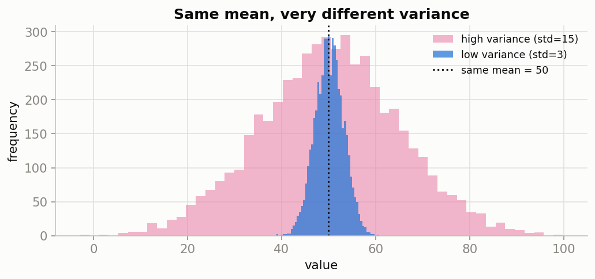

*Two distributions can share the exact same mean (50) while telling completely different stories about consistency. Never trust a mean reported without its spread.*

---

## A.3 Correlation vs. Causation

### Layman's term
Correlation means two things tend to move together. Causation means one thing is *actually making* the other happen. Just because your umbrella sales and your rainfall both go up on the same days doesn't mean umbrellas cause rain.

### Analogy
Every summer, ice cream sales go up. Every summer, drowning incidents also go up. Does ice cream cause drowning? Of course not — a hidden third factor (hot weather) drives both. If you only looked at the correlation, you might wrongly conclude "banning ice cream will reduce drowning."

### Use case
An e-commerce company notices that customers who use a "wishlist" feature spend more money, and concludes "let's force everyone to use wishlists to increase revenue!" But maybe wishlist users were already more engaged, higher-intent shoppers to begin with — the wishlist didn't *cause* the spending, it merely correlated with a type of customer who was always going to spend more. Deploying features based on this false causal leap wastes engineering effort.

### Detailed technical explanation

- **Multicollinearity & feature selection**: The Pearson correlation coefficient (ranges from −1 to +1) is computed pairwise across numeric features during EDA. Two features correlated at, say, 0.95 (e.g., "square footage" and "number of rooms") signal **multicollinearity**, which destabilizes linear model coefficients (their weights become erratic and uninterpretable) and adds redundant information for tree models. Fix: drop one feature, or apply PCA.
- **Spurious correlations in production**: A model will happily learn *any* correlation in the training data — including ones with no real mechanism. When the environment shifts even slightly, a model that leaned on a spurious correlation instead of a true causal driver fails silently. This is a leading cause of **model drift**.
- **Feature leakage red flag**: An unusually high correlation (like 0.98+) between a single feature and the target is not always good news — it's often a sign of **data leakage**, where a feature accidentally contains information that wouldn't be available at real prediction time.
- **Causal inference is a separate discipline**: If your real question is "if I *change* X, will Y change?" (e.g., "if we lower price, will sales rise?"), correlation-based ML is the wrong tool. That requires A/B testing, randomized controlled trials, or causal inference techniques — standard supervised learning cannot, on its own, distinguish correlation from causation.

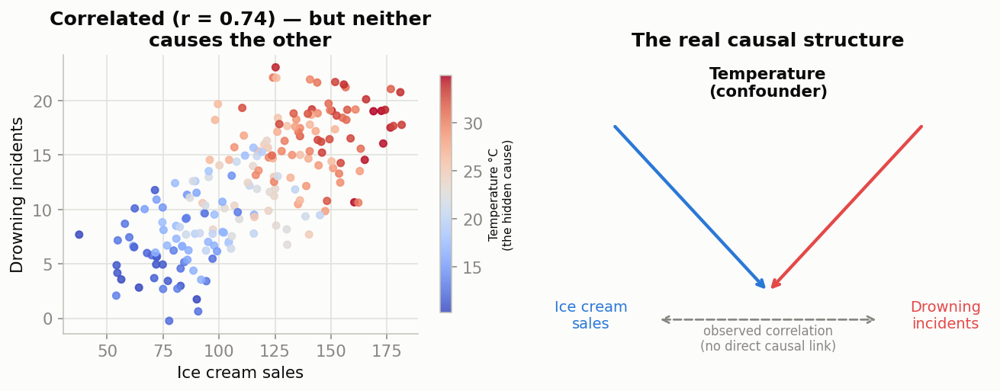

*Ice cream sales and drowning incidents are correlated (r = 0.74) purely because temperature drives both. The right panel shows the real causal structure — there is no arrow directly connecting the two observed variables.*

---

## A.4 Hypothesis Testing & P-Values

### Layman's term
Imagine a friend claims they can flip a coin and make it land heads more often than chance. They flip it 10 times and get 8 heads. Is that proof of a special skill, or could an ordinary lucky person get 8/10 heads just by chance? Hypothesis testing is the formal math for answering exactly this kind of "is this real, or just luck?" question.

### Analogy
A courtroom trial: the default assumption ("null hypothesis") is "the defendant is innocent." The prosecution must produce enough evidence to make "innocent" seem *implausible* beyond reasonable doubt. A p-value is like a numeric version of "how implausible is innocence, given this evidence?" A very small p-value means "if they were truly innocent, this evidence would be astonishingly unlikely to see" — so we reject the innocence assumption.

### Use case
A company changes its checkout button from blue to green and observes a 2% increase in purchases. Was that a real improvement, or could it have happened by random chance among the particular customers who happened to visit that day? A hypothesis test (commonly an A/B test with a t-test or z-test) gives a p-value that answers this before the company invests in redesigning every button.

### Detailed technical explanation

- **Statistical feature selection**: Before training, features can be filtered using formal tests. A **Chi-Squared test** checks whether a categorical feature is independent of a categorical target. An **ANOVA F-test** checks whether a numeric feature's mean differs significantly across target classes. Features with p-value below a threshold (conventionally **α = 0.05**) are considered statistically significant and kept.
- **A/B testing model deployments**: Before replacing an old model with a new one in production, teams run an A/B test with H₀: "the new model performs no differently than the old one." Only if the resulting p-value falls below α do teams conclude the improvement is real rather than noise.
- **Validating a train/test split**: A Kolmogorov-Smirnov test can statistically confirm the training and test sets were drawn from the same distribution — a sanity check that your evaluation numbers will actually generalize.
- **Confidence intervals**: Rigorous evaluation never reports a single point number like "94% accuracy" — it reports "94% ± 2% at 95% confidence," acknowledging the metric itself is an *estimate* with uncertainty.
- **The critical trap**: With a large enough sample, even a *trivially small* difference can produce a p-value below 0.05 ("statistically significant" but practically meaningless). Always pair a p-value with an **effect size** — is the improvement actually big enough to matter?

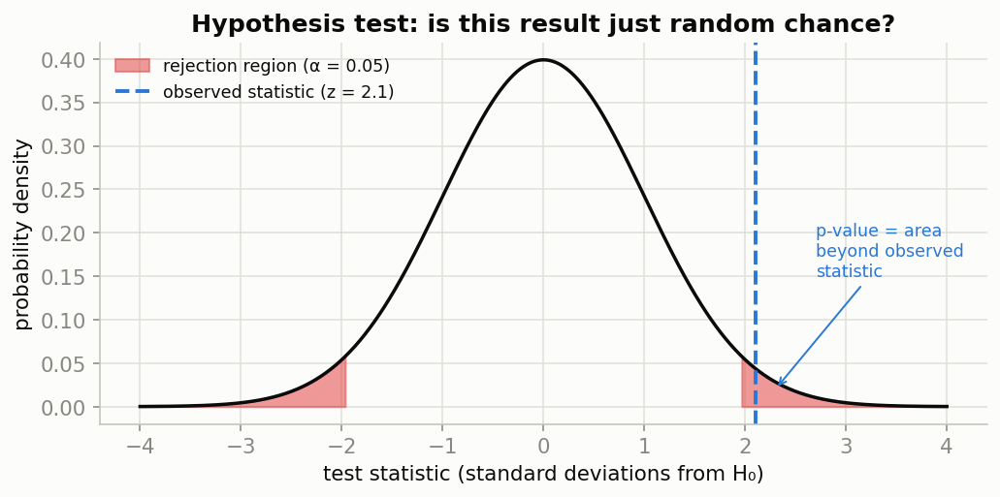

*The shaded red regions are the "rejection region" — outcomes so extreme they'd only happen 5% of the time under pure chance (α = 0.05). The observed statistic (blue dashed line) falls into that rare zone, so we reject the "nothing is happening" assumption.*

---

## A.5 Conditional Probability & Bayes' Theorem

### Layman's term
Regular probability asks "how likely is X?" in a vacuum. **Conditional** probability asks "how likely is X, *now that I already know Y happened*?" Bayes' Theorem is simply the formula for correctly updating your belief once new evidence arrives — it's the mathematics of "wait, let me reconsider given what I just learned."

### Analogy
You hear a bell and think "that's probably an ice cream truck." But if you also know it's currently a snowstorm in January, you should *update* that belief — an ice cream truck is far less likely in a blizzard than a delivery van's bell-like alert. Bayes' Theorem is the precise math for combining "how common is this event normally" with "what does the new evidence actually tell me," rather than reacting to the evidence alone.

### Use case
This is precisely why a doctor doesn't panic over one positive test in isolation — and it is the exact mathematical foundation behind the Naive Bayes classifier (used for spam filtering and text classification) and behind adjusting a fraud model's alerts using how rare fraud actually is.

### Detailed technical explanation

The formula:

```
P(A | B) = [ P(B | A) x P(A) ] / P(B)
```

In plain words: *the probability of A, given that B happened* = *how likely B is if A were true* × *how common A is to begin with*, divided by *how common B is overall*.

**Why this single formula is one of the most important ideas in applied ML:**

- **It explains why "reliable" tests can still mostly be wrong on rare events.** A screening test that is 90% sensitive (catches 90% of real cases) and 95% specific (correctly clears 95% of healthy people) sounds excellent. But if the condition it's testing for only affects 1% of the population, the math works out very differently than intuition suggests:

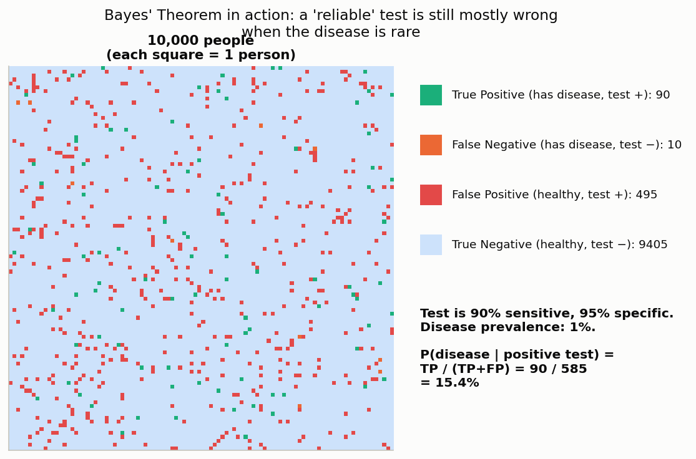

  *Out of 10,000 people, only 90 who test positive are actually true positives — but 495 healthy people also test positive (false positives), because there are so many more healthy people to begin with. So `P(disease | positive test) = 90 / (90+495) = 15.4%` — dramatically lower than the test's "95% accurate" reputation would suggest. This exact mechanism is why a single positive screening test is always followed by a confirmatory test before any serious action is taken, and it is the mathematical root cause of the fraud-detection trap in Question 1 of the comprehension check.*

- **Naive Bayes classifiers**: An entire family of ML classifiers (still a strong, fast baseline for spam detection and text classification) works by directly applying this formula — computing `P(spam | these words appear)` from `P(these words | spam)` and the overall rate of spam, treating each word's presence as independent evidence to combine.
- **Prior vs. posterior — a core ML vocabulary pair**: `P(A)` (before seeing evidence) is called the **prior**; `P(A | B)` (after seeing evidence) is called the **posterior**. Any model that updates a belief as new data arrives (Bayesian optimization for hyperparameter tuning, Bayesian A/B testing) is directly built on this prior-to-posterior update mechanism.
- **Connects directly back to Precision**: Notice the Bayes' Theorem result above, `TP / (TP + FP) = 15.4%`, is *exactly* the Precision formula from Part B.1. Precision **is** `P(actually positive | predicted positive)` — a direct, real-world application of Bayes' Theorem, which is why Precision crashes on rare-event problems unless the model is exceptionally good, not just "pretty good."

---

## A.6 The Central Limit Theorem & Confidence Intervals

### Layman's term
If you take one random sample of people and measure their average height, you might get a slightly weird number by chance. But if you took *many* different samples and looked at the distribution of all those sample averages, something remarkable happens: that distribution of averages always looks like a clean, symmetric bell curve — **even if the original data itself was nowhere close to a bell curve.** That surprising fact is the Central Limit Theorem (CLT), and it's the reason so much of statistics can safely assume "Normal-ish" behavior even when raw data is messy.

### Analogy
Imagine measuring the exact time it takes for pizza delivery — some deliveries are fast, most are medium, and a few take forever (a skewed distribution, long right tail). Now imagine repeatedly grabbing random groups of 30 deliveries and averaging each group. Even though individual delivery times are skewed, the *averages* of these groups will cluster into a smooth, symmetric bell shape. Averaging tames chaos.

### Use case
This is precisely why we're allowed to compute a "95% confidence interval" around a model's accuracy score, or around an A/B test's conversion rate, even though the underlying user behavior is messy and non-Normal — the CLT guarantees the *averaging process itself* behaves predictably.

### Detailed technical explanation

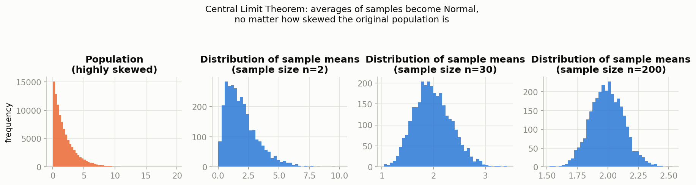

*Starting from a heavily skewed population (left panel), the distribution of sample means becomes progressively more symmetric and bell-shaped as sample size grows from n=2 to n=30 to n=200 — this holds true no matter what the original population's shape was.*

- **Why this matters for evaluation metrics**: When you report "94% accuracy," that number came from averaging correct/incorrect outcomes across your test set. The CLT is what licenses you to treat that average as approximately Normally distributed, which is what makes a **confidence interval** mathematically valid: `accuracy ± z × (std_error)`, typically reported as "94% ± 2% at 95% confidence."
- **Standard Error shrinks with more data**: The width of a confidence interval is driven by sample size — specifically, standard error `= std / sqrt(n)`. This is a direct, practical reason bigger test sets produce more *trustworthy* metric estimates, not just bigger numbers.
- **A/B testing validity**: Every A/B test's p-value calculation (Part A.4) leans on the CLT to justify treating the difference between two group averages as approximately Normal, which is what makes the whole hypothesis-testing machinery valid even when individual user behavior is nothing like a bell curve.
- **Why n ≥ 30 is a commonly cited rule of thumb**: Notice in the chart above, by n=30 the sample-mean distribution is already quite bell-shaped even though the population was sharply skewed — this is where the popular (if slightly oversimplified) "n ≥ 30 is enough for CLT to kick in" guideline comes from.

---

## Part B — Evaluation Metrics (Complete ML Engineer Reference)

Evaluation metrics answer the single most important question in ML: **"is my model actually good, and good at what, specifically?"** A model can look excellent on one metric and be dangerously useless in production if you picked the wrong metric to trust.

## B.1 Classification Metrics

### Layman's term
Imagine an airport security screener. Every day, they either correctly catch a threat, correctly wave through a safe passenger, wrongly flag an innocent traveler, or — worst of all — wrongly let a real threat through. Every classification metric in ML is just a different way of scoring that screener's performance, weighted toward the mistake that scares you most.

### The Confusion Matrix — the foundation of every metric below

Here is a **real confusion matrix** from an actual model trained on this page (a Logistic Regression classifier predicting malignant vs. benign tumors from the classic Wisconsin Breast Cancer dataset, evaluated on 143 held-out test patients it never saw during training):

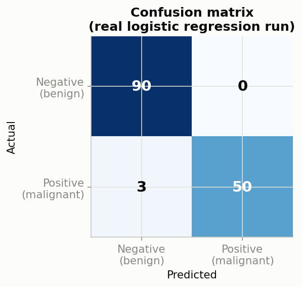

| | Predicted Negative (benign) | Predicted Positive (malignant) |
|---|---|---|
| **Actual Negative (benign)** | True Negative (TN) = 90 | False Positive (FP) = 0 |
| **Actual Positive (malignant)** | False Negative (FN) = 3 | True Positive (TP) = 50 |

Every metric below is computed directly from these four numbers.

#### Accuracy
**Formula:** `(TP + TN) / Total = (50 + 90) / 143 = 97.9%`
**Plain meaning:** "Out of everything, what fraction did I get right overall?"
**When to trust it:** Only when classes are roughly balanced. On this dataset (63% benign / 37% malignant) it's reasonably safe, but on a dataset with 99% one class, a model that just guesses the majority class every time scores 99% accuracy while being medically useless. **Never lead with accuracy on an imbalanced problem.**

#### Precision
**Formula:** `TP / (TP + FP) = 50 / (50 + 0) = 100%`
**Plain meaning:** "Of everyone I flagged as malignant, how many actually were?"
**When to prioritize it:** When a **False Positive is expensive or harmful** — e.g., wrongly telling a healthy patient they have cancer causes real psychological harm and unnecessary invasive follow-up procedures; a spam filter that blocks an important client email; freezing an innocent customer's bank account.

#### Recall (a.k.a. Sensitivity, True Positive Rate)
**Formula:** `TP / (TP + FN) = 50 / (50 + 3) = 94.3%`
**Plain meaning:** "Of everyone who actually had cancer, how many did I successfully catch?"
**When to prioritize it:** When a **False Negative is catastrophic** — missing an actual cancer diagnosis, letting a real fraudulent transaction slip through, failing to detect a security intrusion. In medical and safety-critical systems, Recall is almost always the metric leadership should be losing sleep over.

#### F1-Score
**Formula:** `2 × (Precision × Recall) / (Precision + Recall) = 2 × (1.0 × 0.943) / (1.0 + 0.943) = 97.1%`
**Plain meaning:** The harmonic mean of Precision and Recall — it punishes a model that sacrifices one to inflate the other far more than a simple average would.
**When to prioritize it:** When you need one balanced number and both error types carry roughly comparable real-world cost, and especially on **imbalanced datasets**, where accuracy is misleading.

#### ROC-AUC (Area Under the ROC Curve)
**Plain meaning:** "Across every possible decision threshold, how well does my model separate the two classes?" A value of 1.0 is a perfect separator; 0.5 is a coin flip.
**When to use it:** To compare models independent of any single chosen threshold, and when both classes matter roughly symmetrically. **Caution:** ROC-AUC can look deceptively good on severely imbalanced data — the Precision-Recall curve is more honest in that situation.

#### Precision-Recall Curve
**Plain meaning:** Shows exactly how Precision trades off against Recall as you slide the decision threshold from strict to lenient. This is the single most important diagnostic chart for an imbalanced classification problem (fraud, disease, rare-event detection).

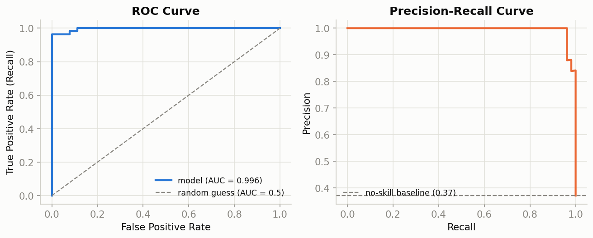

*Left: ROC curve for the same cancer model (AUC = 0.996 — excellent separation). Right: Precision-Recall curve — notice precision stays near-perfect until recall pushes very high, meaning this model rarely cries wolf even when trying hard to catch every case.*

#### Log Loss (Cross-Entropy Loss)
**Plain meaning:** Unlike accuracy (which only cares if you were right or wrong), Log Loss punishes *confidently wrong* predictions far more severely than *hesitantly wrong* ones. A model that says "99% sure it's fraud" and is wrong pays a much bigger penalty than one that says "51% sure."
**When to use it:** Whenever your downstream system cares about the actual *probability* output, not just the final label — e.g., ranking transactions by fraud risk for manual review.

#### Specificity (True Negative Rate)
**Formula:** `TN / (TN + FP) = 90 / (90 + 0) = 100%`
**Plain meaning:** "Of everyone who is actually healthy/negative, how many did I correctly clear?" Recall's mirror image — Recall focuses on catching positives, Specificity focuses on correctly clearing negatives.
**When to prioritize it:** Screening scenarios where wrongly alarming a healthy/innocent person has a real cost (unnecessary biopsies, wrongly frozen bank accounts) — often reported *alongside* Recall/Sensitivity, especially in medical diagnostics, as the "sensitivity/specificity" pair.

#### Matthews Correlation Coefficient (MCC)
**Formula:** `(TP×TN − FP×FN) / sqrt[(TP+FP)(TP+FN)(TN+FP)(TN+FN)]`, ranges −1 to +1.
**Plain meaning:** A single balanced score that uses *all four* confusion matrix cells at once (unlike F1, which ignores True Negatives entirely). +1 is a perfect prediction, 0 is no better than random guessing, −1 is total disagreement.
**When to prioritize it:** Many ML researchers consider MCC the single most reliable metric for imbalanced binary classification, specifically *because* it doesn't ignore True Negatives the way F1 does — it's harder to accidentally game than F1 or accuracy.

### Multi-Class Classification: Averaging Precision, Recall & F1 Across Many Classes

Everything above assumed two classes (positive/negative). But many real problems — like Project 3's handwritten-digit recognizer (10 classes) later in the companion Walkthroughs file — have many classes at once. Precision and Recall are naturally defined *per class* (treating each class as "positive" and all others as "negative" in turn), so we need a rule for combining 10 separate Precision scores into one headline number:


- **Macro average**: Compute the metric separately for every class, then take a plain, unweighted average. **Plain meaning:** "Treat every class as equally important, regardless of how many examples it has." Best when a rare class matters just as much as a common one (e.g., a rare digit or rare disease subtype must not be quietly ignored).
- **Micro average**: Pool every class's TP, FP, FN together globally, then compute one metric from those totals. **Plain meaning:** "Every individual prediction counts equally." In multi-class problems where each item gets exactly one label, micro-averaged Precision, Recall, and F1 all equal plain Accuracy — so micro-average is most useful when classes are heavily imbalanced and you specifically want large classes to dominate the score.
- **Weighted average**: Like macro, but each class's score is weighted by how many true examples it has (its "support"). **Plain meaning:** "Balance between caring about every class, but let common classes count a bit more, matching their real-world frequency." This is the most commonly reported default in practice.

*In the chart above (a real 10-class digit classifier), all three averaging strategies land within a hair of each other (0.980) because this dataset happens to be nearly class-balanced. On a genuinely imbalanced multi-class problem, these three numbers can diverge substantially — always check which averaging strategy a reported metric used before trusting a comparison between two models.*

### Choosing the right metric — a decision guide

| Situation | Lead metric |
|---|---|
| Classes are balanced, all errors equally costly | Accuracy |
| False Positives are the expensive mistake | Precision |
| False Negatives are the expensive/dangerous mistake | Recall |
| Need one balanced number, especially on imbalanced data | F1-Score |
| Comparing models across all thresholds | ROC-AUC |
| Severely imbalanced classes (fraud, rare disease) | Precision-Recall curve / F1 on the minority class |
| Downstream system uses raw probabilities | Log Loss |
| Need one number that uses all 4 confusion-matrix cells, hard to game | MCC |
| Wrongly clearing a negative case is the costly mistake | Specificity |
| More than 2 classes, every class should count equally | Macro-averaged Precision/Recall/F1 |
| More than 2 classes, imbalanced, want large classes to dominate | Micro-averaged Precision/Recall/F1 (= Accuracy) |
| More than 2 classes, want a realistic blended default | Weighted-averaged Precision/Recall/F1 |

---

## B.2 Regression Metrics

### Layman's term
If classification is "which bucket does this belong to?", regression is "what exact number should this be?" — like predicting a house's price rather than just "expensive or cheap." Regression metrics all measure the same basic idea: *how far off, on average, are my number-guesses from the true numbers?*

### Analogy
Think of a dart player aiming for the exact center of a target, except now "the center" is a different location on every single throw (like predicting a different house's exact price each time). Regression metrics measure the average distance between where the dart landed and where it should have landed.

### Use case
A real-estate startup predicts home sale prices to advise sellers on listing prices. If predictions are consistently off by $50,000 on a $300,000 home, that's useless advice — regression metrics quantify exactly how far off the model is, in units the business understands (dollars).

### Detailed technical explanation

Using a **real Linear Regression model** trained on this page (predicting a diabetes disease-progression score from 10 patient measurements, evaluated on held-out test patients):

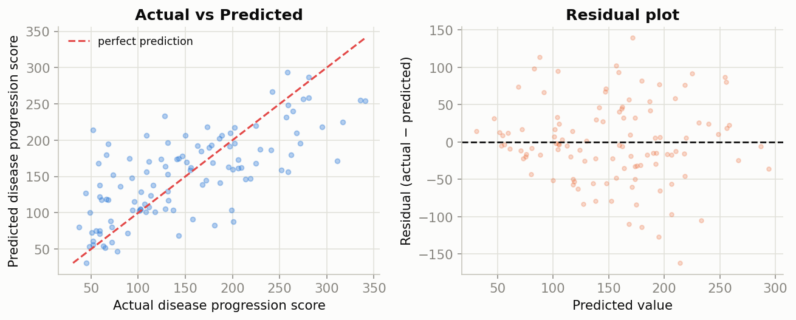

- **Mean Absolute Error (MAE)** = average of `|actual − predicted|` across all predictions. **Plain meaning:** "On average, how many units am I off by?" Easy to explain to non-technical stakeholders because it's in the same units as the target (e.g., "off by $12,000 on average"). Treats every error equally — a $100,000 miss counts the same, unit-for-unit, as ten $10,000 misses.
- **Mean Squared Error (MSE)** = average of `(actual − predicted)²`. Squaring means large errors are punished disproportionately harder than small ones — a single huge miss dominates the score. This is also literally the loss function most regression algorithms directly minimize during training.
- **Root Mean Squared Error (RMSE)** = `√MSE`. Brings the units back to the original scale (like MAE) while still penalizing big misses more than MAE does. RMSE is almost always ≥ MAE, and the gap between them tells you something: a large gap means a few big outlier errors are dragging RMSE up.
- **R² (Coefficient of Determination)** = the fraction of variance in the target that the model explains, ranging from (theoretically) −∞ to 1.0. **Plain meaning:** "Compared to just always guessing the average, how much better is my model?" R² = 0 means "no better than guessing the mean every time." R² = 1 means "perfect predictions." A real, honest R² of 0.45-0.50 (like the model on this page) is completely normal and useful for noisy real-world biological/behavioral data — don't expect 0.95+ outside of clean physical systems.
- **Adjusted R²**: Plain R² has a mathematical quirk — it can never decrease as you add more features, even completely useless ones, which tempts engineers into overfitting by feature-stuffing. Adjusted R² fixes this by explicitly penalizing the score for every extra feature added: `1 − [(1−R²)(n−1) / (n−p−1)]`, where n = sample count and p = number of features. **When to use it:** Whenever comparing two models with a *different number of features* — plain R² is not a fair comparison in that situation, Adjusted R² is.
- **Mean Absolute Percentage Error (MAPE)** = average of `|actual − predicted| / |actual|`, expressed as a percentage. **Plain meaning:** "On average, what percentage off am I?" Unlike MAE/RMSE, MAPE is unit-free, which makes it easy to compare error rates across completely different problems (e.g., "8% average error" is comparable whether predicting house prices or website traffic). **Caution:** MAPE breaks down (divides by near-zero or produces huge/undefined values) whenever the actual value can be zero or very small — never use it on a target that can be zero.

**The residual plot is the most underrated regression diagnostic.** Residuals (actual − predicted) should look like a random, formless cloud scattered evenly around zero. If you instead see a funnel shape (residuals fanning out as predictions increase), your model violates the "constant variance of errors" assumption (**heteroscedasticity**), and a plain accuracy number would never have revealed this — only the picture does.

---

## B.3 Clustering Metrics (Unsupervised Learning)

### Layman's term
Classification and regression both require someone to have already labeled the correct answers. Clustering is different — nobody tells the algorithm the "right" groups; it has to *discover* natural groupings on its own, like sorting a mixed box of buttons into piles by similarity without being told the category names in advance.

### Analogy
Imagine dumping a huge box of assorted candy onto a table and asking someone to group it "by whatever similarity makes sense" without telling them the categories. They might group by color, or by size, or by wrapper type. There's no single "correct" grouping to check against — so how do you measure if the grouping is *good*? That's exactly the challenge clustering metrics solve.

### Use case
An e-commerce company wants to segment customers into groups for targeted marketing, without predefined categories. K-Means clustering finds natural groupings (e.g., "frequent small purchasers," "rare big spenders"), and clustering metrics tell the data science team whether those groupings are actually meaningfully distinct or just noise.

### Detailed technical explanation

Because there's no ground-truth label to compare against, clustering metrics instead measure **internal cohesion and separation** — do points within a cluster sit close together, and are different clusters far apart from each other?

- **Silhouette Score** (ranges −1 to +1): For each point, compares its average distance to points in its *own* cluster versus its average distance to points in the *nearest other* cluster. A score near +1 means the point is well-matched to its own cluster and far from neighboring clusters (great clustering). A score near 0 means the point sits right on the boundary between two clusters. A negative score means the point was probably assigned to the wrong cluster entirely.
- **Inertia (Within-Cluster Sum of Squares)**: The total squared distance from each point to its assigned cluster's center. Lower is tighter, but inertia *always* decreases as you add more clusters (even meaningless ones), so it's used via the **"Elbow Method"** — plot inertia against number of clusters (k) and look for the point where adding more clusters stops giving a meaningful improvement.
- **Davies-Bouldin Index**: Measures the average "similarity" between each cluster and its most-similar other cluster (lower is better — you want clusters that look nothing like their neighbors).

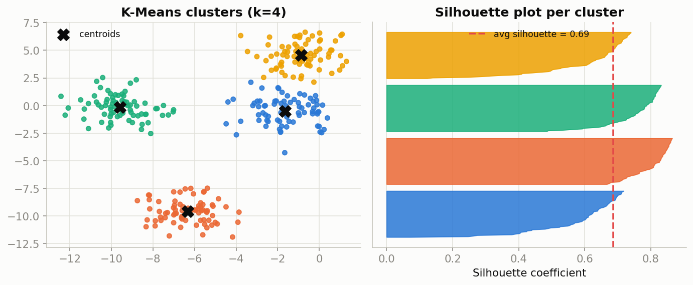

*Left: K-Means found 4 natural groups (real synthetic data, colored by assigned cluster, black X marks are the cluster centers). Right: the silhouette plot — most points score well above the average line (red dashed), meaning the clusters are well-separated and each point is clearly closer to its own cluster's center than to any other.*

---

## Part C — Cross-Validation: Evaluating a Model Honestly

### Layman's term
A single train/test split is like giving a student exactly one practice exam before the real thing — their score depends partly on which particular practice questions they happened to get, good luck or bad luck included. Cross-validation is like giving them five *different* practice exams built from the same material, and averaging the scores — a far more trustworthy read on their actual ability.

### Analogy
Imagine judging a chef by a single dish they cooked on a single night. Maybe the ingredients were unusually good that day, or they were just lucky. Now imagine instead having them cook five different dishes on five different nights and averaging the reviews — the average is a much fairer, more stable judgment of their true skill, not a fluke of one lucky (or unlucky) night.

### Use case
Every model comparison throughout this document and the companion Walkthroughs (Logistic Regression vs. Random Forest, Neural Network vs. SVM) is more trustworthy when validated across multiple folds rather than a single lucky/unlucky split — this is exactly what was done via `cross_val_score` in Project 2's classification walkthrough to sanity-check that Logistic Regression's win over Random Forest wasn't just an artifact of one particular test set.

### Detailed technical explanation

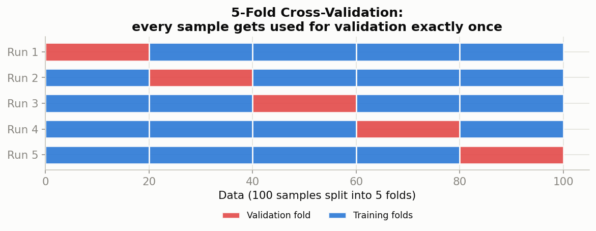

**K-Fold Cross-Validation** splits the training data into *k* equal chunks ("folds"). It then runs *k* separate training rounds: each round holds out one different fold as validation data and trains on the remaining k−1 folds. Every single data point ends up used for validation exactly once, across the k rounds. The final reported score is the **average** (and standard deviation) across all k rounds.

- **Why the standard deviation across folds matters just as much as the average**: If 5-fold CV produces accuracy scores of [94%, 93%, 95%, 94%, 94%], that's a stable, trustworthy model (low std). If instead it produces [98%, 70%, 95%, 60%, 90%], the *average* might look similar to a stable model's average, but the huge variability (high std) reveals the model's performance depends heavily on which specific data it happened to see — a serious red flag invisible to a single train/test split.
- **Stratified K-Fold**: For classification, especially with imbalanced classes, each fold should preserve the original class ratio — exactly the same reasoning as `stratify=y` in a plain train/test split (see the companion Walkthroughs file), just applied to every fold instead of one split.
- **Why K-Fold CV is used for model *selection*, while the final test set is still needed for the final honest *score***: Cross-validation is what you use while comparing models and tuning hyperparameters (so you don't burn your one precious untouched test set on every experiment). Once a final model is chosen, it is still evaluated one last time on the completely untouched test set, which was never part of any fold, for the final, honest, reportable number.
- **Common values of k**: k=5 and k=10 are by far the most common choices — a good balance between computational cost (higher k = more training runs) and estimate stability (higher k = each validation fold is smaller, but you get more of them).
- **Leave-One-Out Cross-Validation (LOOCV)**: The extreme case where k = number of samples — every single data point gets its own round as the sole validation example. Extremely thorough but computationally expensive; typically reserved for very small datasets.

---

## Part D — Data Preprocessing Statistics Toolkit (Quick Reference)

| Technique | What it does | When to use |
|---|---|---|
| Mean imputation | Fill missing values with column mean | Symmetric, outlier-free numeric feature |
| Median imputation | Fill missing values with column median | Skewed numeric feature, or outliers present |
| Mode imputation | Fill missing values with most frequent category | Categorical feature |
| Z-score standardization | `(x - mean) / std` → mean 0, std 1 | Distance-based & gradient-based algorithms (KNN, SVM, neural nets, logistic regression) |
| Min-Max normalization | `(x - min) / (max - min)` → range [0, 1] | Bounded-input algorithms (neural nets with sigmoid, image pixels) |
| Robust scaling | Uses median & IQR instead of mean & std | Data with significant outliers |
| Log transform | `log(x + 1)` | Right-skewed features (income, prices, counts) |
| One-Hot Encoding | One binary column per category | Nominal categorical data (no inherent order) |
| Ordinal Encoding | Integer per category, preserving rank | Ordinal categorical data (true order exists) |
| Variance Threshold | Drop near-constant features | Removing uninformative columns before training |

---

## Part E — Bias-Variance Tradeoff (The Master Diagnostic)

### Layman's term
Imagine two different archers. Archer A always shoots into roughly the same spot — but it's consistently to the left of the bullseye (that's **high bias**: systematically wrong in the same way every time, regardless of effort). Archer B's arrows scatter wildly all over the target, sometimes near the bullseye, sometimes far away (that's **high variance**: no consistent pattern, wildly sensitive to small changes in stance or wind). A good model is like a great archer: consistently *and* accurately near the bullseye.

### Use case
A team trains a model to predict loan defaults. If the model is too simple (e.g., using only "annual income" and ignoring everything else), it will underperform on both training AND new data — high bias, or **underfitting**. If the model is absurdly complex (memorizing every applicant's exact ID), it will look perfect on training data but fail wildly on new applicants — high variance, or **overfitting**. The tradeoff is finding the complexity level that generalizes best.

### The mathematics

Total expected prediction error decomposes cleanly into three additive parts:

```
Total Error = Bias² + Variance + Irreducible Error
```

- **Bias²** — systematic error from the model being too simple to capture real patterns (underfitting's fingerprint).
- **Variance** — error from the model being overly sensitive to the specific training sample it happened to see (overfitting's fingerprint).
- **Irreducible Error** — inherent noise in the data itself that no model, however perfect, can ever eliminate.

As model complexity increases, bias typically falls (the model can capture more nuance) while variance typically rises (the model has more freedom to latch onto noise). The engineer's job is to find the complexity level that minimizes their *sum*, not either term alone.

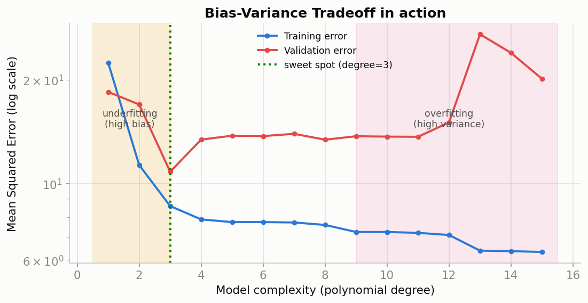

*A real experiment: polynomial regression fit to noisy cubic data at increasing degrees of complexity. Degrees 1-2 (yellow zone) underfit — both training and validation error are high. Degrees 9+ (pink zone) overfit — training error keeps dropping toward zero while validation error explodes upward. Degree 3 (green dashed line) is the sweet spot where validation error is minimized.*

### Diagnosing from training vs. validation curves

| Symptom | Diagnosis | Fix |
|---|---|---|
| Both training AND validation error are high, close together | **Underfitting** (high bias) | Increase model complexity, add features, reduce regularization, train longer |
| Training error low, validation error high, large & widening gap | **Overfitting** (high variance) | More training data, add regularization (L1/L2), reduce complexity, dropout, early stopping, cross-validation |
| Training error low, validation error low, close together, both stable | **Good fit** | Ship it — but keep monitoring in production for drift |

---

## Part F — Master Comprehension Check

### Question 1
*A fraud-detection model achieves 99% accuracy but fails miserably in production, missing nearly every real fraud case. What statistical oversight occurred?*

**Answer:** This is the classic **class imbalance trap**. Fraud datasets are typically 99% legitimate / 1% fraud — a model that predicts "not fraud" for literally every transaction scores 99% accuracy while achieving 0% Recall on the class that actually matters. The fix: evaluate with Precision/Recall/F1 specifically on the minority class, apply resampling (SMOTE oversampling or undersampling), and likely lower the decision threshold below 0.5 to favor Recall, since missing real fraud is almost always costlier than over-flagging a legitimate transaction.

### Question 2
*A model to predict employee attrition finds "has_exit_interview_scheduled" is the single strongest predictor at r = 0.98. The team ships it immediately. What went wrong?*

**Answer:** **Data leakage.** A near-perfect correlation this high usually means the feature only becomes true *after* the outcome has effectively already happened — an exit interview is scheduled once someone has already decided to leave, so this "predictor" is really just a restatement of the answer, slightly earlier in time. At the real moment a prediction is needed (before any resignation signal exists), this feature would read "No" for nearly everyone and be useless. Fix: always ask "would this feature's value actually be known at the moment I need to predict?" before trusting a suspiciously perfect correlation.

### Question 3
*Training accuracy is 98%, validation accuracy is 97%, both stable. A colleague insists this is overfitting and the model must be simplified. Agree?*

**Answer:** Disagree, on the evidence given — this is the textbook signature of a **good fit**, not overfitting. Real overfitting requires a *large, widening* gap (e.g., 98% vs. 70%), which isn't present here; a stable 1-point gap doesn't meet that bar. Before touching the model, verify: (1) the validation set was never leaked into training, (2) performance holds on the untouched final test set, and (3) whether 97-98% is even the *right* thing to look at — on an imbalanced classification task, both numbers could still be hiding a Recall problem on the minority class, meaning the real next step is re-evaluating with class-specific metrics, not "simplify the model."

### Question 4
*A rare disease affects 1 in 1,000 people. A screening test is 99% sensitive and 99% specific — impressive by any normal standard. A patient tests positive. A junior analyst tells them "you almost certainly have the disease." Is the analyst right?*

**Answer:** No — this is a direct application of **Bayes' Theorem** (Part A.5), and the analyst has committed the exact error that formula exists to prevent. Out of 1,000,000 people, roughly 1,000 actually have the disease, and the test correctly flags about 990 of them (99% sensitivity). But among the remaining 999,000 healthy people, 1% still test positive due to imperfect specificity — that's roughly 9,990 false positives. So among everyone who tests positive (990 true + 9,990 false ≈ 10,980 people), only about `990 / 10,980 ≈ 9%` actually have the disease — nowhere close to "almost certainly." The test's impressive-sounding 99%/99% numbers describe its behavior *given* true disease status, not the reverse question the patient actually cares about (`P(disease | positive test)`), and confusing the two directions of a conditional probability is one of the most common and consequential statistical errors in applied science. The correct response is a confirmatory second test, exactly as real screening protocols require.

### Question 5
*A team runs 5-fold cross-validation on two candidate models. Model A: mean accuracy 91%, fold scores [90%, 91%, 92%, 91%, 91%]. Model B: mean accuracy 92%, fold scores [99%, 60%, 98%, 95%, 93%]. Which model should be shipped?*

**Answer:** Model A, despite its lower mean — and this question exists specifically to demonstrate why cross-validation reports **spread, not just the average** (Part C). Model A's fold scores are tightly clustered (std ≈ 0.7 points), meaning its performance is stable and predictable regardless of which slice of data it happened to see — a trustworthy signal about real-world behavior. Model B's fold scores swing wildly (from 60% to 99%, std ≈ 15 points), meaning its performance is highly dependent on which particular data it was trained/evaluated on — a serious red flag that the model is unstable, likely overfitting certain folds, or being thrown off by a small number of unusual examples. A model that might score anywhere from 60% to 99% in production, depending on factors outside anyone's control, is a far riskier deployment than one that reliably scores around 91% every time — this is precisely the kind of instability a single train/test split (Model B might have gotten one of its lucky 98-99% splits) would have completely hidden.
