# End-to-End Machine Learning Project Walkthroughs
### Three Complete Projects, Every Step Explained: What, How, and *Why*

> **A note on datasets:** All three projects below use datasets bundled directly inside `scikit-learn` (no internet download required), so every line of code here is fully reproducible offline, exactly as run to produce the real numbers and charts on this page. Project 1 is a **regression** problem, Project 2 is a **binary classification** problem, and Project 3 is a **multi-class image classification** problem — deliberately chosen to be different data types (tabular numeric, tabular numeric, and raw pixels) so you see the full range of what an ML engineer handles.

---

# Project 1 — Regression: Predicting Diabetes Disease Progression

**The business/scientific question:** Given 10 baseline measurements taken from a patient a year ago (age, sex, BMI, blood pressure, and six blood serum measurements), can we predict a quantitative measure of how much their diabetes has progressed one year later? This mirrors real clinical ML work: predicting a continuous risk or progression score from measurable inputs.

**Why this dataset:** It's a genuine, widely-used regression benchmark (442 real, anonymized patients) bundled directly with scikit-learn, so it needs no internet fetch and is small enough to explain every step in full transparency.

## Step 1 — Load and Understand the Data (Exploratory Data Analysis)

```python
from sklearn.datasets import load_diabetes
data = load_diabetes(as_frame=True)
df = data.frame
X = data.data          # 442 patients x 10 features
y = data.target        # disease progression score, range ~25-346
```

**Why this step exists:** You cannot responsibly model data you don't understand. Skipping EDA is how people accidentally train on leaked columns, miss critical outliers, or apply the wrong transformation. This step always comes first, before any modeling.

**What we look at, and why:**
- **Shape** (442 rows × 10 features): confirms we have enough data — with only 10 features and 442 samples, we should favor simpler models over deep neural networks, which need far more data to avoid overfitting.
- **Target distribution**: is the progression score symmetric or skewed? This decides whether we need to transform it before modeling.
- **Correlation with target**: which of the 10 features actually relate to the outcome? This is our first hint at feature importance, long before we train anything.

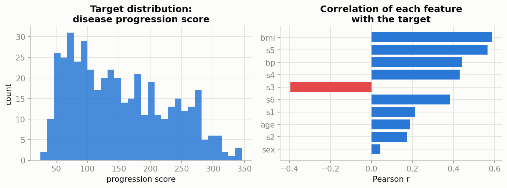

*Left: the target is reasonably symmetric (no urgent need for a log-transform). Right: `bmi` and `s5` (a blood serum measurement) show the strongest correlation with disease progression — this matches real clinical knowledge that BMI is a major diabetes risk factor, which is a good sanity check that the data makes sense.*

## Step 2 — Train/Test Split

```python
from sklearn.model_selection import train_test_split
X_train, X_test, y_train, y_test = train_test_split(X, y, test_size=0.2, random_state=42)
```

**Why this step exists:** If we evaluate a model on data it already memorized during training, we get a falsely optimistic score that tells us nothing about how it will perform on a genuinely new patient. The test set (20% here, held out and untouched until the very end) simulates "new patients the model has never seen."

**Why `random_state=42`:** Fixes the random shuffle so the split is reproducible — anyone re-running this code gets the identical split, which matters for debugging and fair comparison between models.

## Step 3 — Feature Scaling

```python
from sklearn.preprocessing import StandardScaler
scaler = StandardScaler().fit(X_train)      # fit ONLY on training data
X_train_s = scaler.transform(X_train)
X_test_s = scaler.transform(X_test)
```

**Why this step exists:** Linear Regression and Ridge Regression use gradient-based or matrix-based optimization that is sensitive to the scale of each feature. Although this particular dataset actually arrives pre-normalized, scaling is included here because it is a required, non-optional habit — most real-world datasets are *not* pre-scaled, and skipping this step on raw data would let large-magnitude features unfairly dominate the model.

**Why `.fit()` only on training data:** If we fit the scaler on the *entire* dataset (train + test combined), information about the test set's mean and spread would leak into training — a subtle form of data leakage that inflates test performance dishonestly.

## Step 4 — Train Multiple Models of Increasing Complexity

```python
from sklearn.linear_model import LinearRegression, Ridge
from sklearn.ensemble import RandomForestRegressor

models = {
    "Linear Regression": LinearRegression(),
    "Ridge (L2 regularized)": Ridge(alpha=1.0),
    "Random Forest": RandomForestRegressor(n_estimators=300, max_depth=4, random_state=42),
}
for name, model in models.items():
    model.fit(X_train_s, y_train)
```

**Why we train THREE models instead of jumping straight to the "best" one:** Model selection is empirical, not guesswork. We start simple (plain Linear Regression — fast, interpretable, a strong baseline), add regularization (Ridge — shrinks coefficients to fight overfitting when features are correlated), and add a fundamentally different, more flexible approach (Random Forest — captures non-linear relationships plain linear models cannot). Comparing all three tells us whether the extra complexity of a Random Forest is actually *earning its keep* on this problem, or just adding risk of overfitting for no real gain.

**Why `max_depth=4` on the Random Forest:** With only 442 patients, letting trees grow unrestricted would let the forest memorize noise (overfitting) rather than learn generalizable patterns. Capping tree depth is a direct, practical application of the bias-variance tradeoff — deliberately trading a little bias for much lower variance.

## Step 5 — Evaluate on the Held-Out Test Set

```python
from sklearn.metrics import mean_absolute_error, mean_squared_error, r2_score
import numpy as np

for name, model in models.items():
    pred = model.predict(X_test_s)
    print(name, mean_absolute_error(y_test, pred), np.sqrt(mean_squared_error(y_test, pred)), r2_score(y_test, pred))
```

**Real results from this exact run:**

| Model | MAE | RMSE | R² |
|---|---|---|---|
| Linear Regression | 42.79 | 53.85 | 0.453 |
| Ridge (L2 regularized) | 42.81 | 53.78 | 0.454 |
| **Random Forest** | **43.06** | **53.06** | **0.469** |

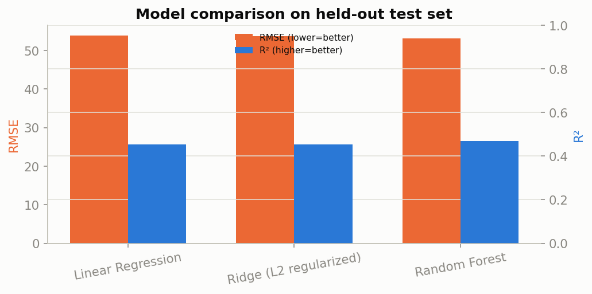

**Why we report MAE, RMSE, AND R² together, not just one:** MAE tells the team "on average we're off by ~43 points" in a business-readable unit. RMSE, being slightly higher than MAE, tells us there are a few larger misses dragging it up (if RMSE were dramatically higher than MAE, that would be a red flag for big outlier errors). R² of ~0.47 tells us the model explains under half the variance — for noisy biological data, this is realistic and usable for **risk stratification** (ranking patients from low to high projected risk), even though it wouldn't be precise enough for, say, exact dosage calculations.

**Why Random Forest wins here, but only barely:** The relationship between these blood measurements and disease progression is mostly linear, so a complex model has little room to improve — this is a valuable, realistic lesson: **more complexity does not automatically mean a better model.** Always test simple baselines first.

## Step 6 — Diagnose the Best Model: Actual vs. Predicted and Residuals

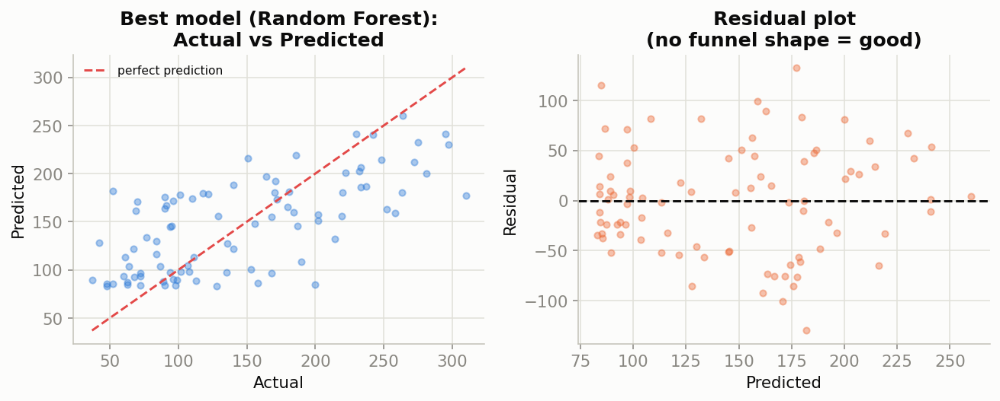

**Why we plot residuals, not just report R²:** A single R² number can hide serious structural problems. If residuals fanned out into a funnel shape as predictions increased (**heteroscedasticity**), it would mean the model is far less reliable for high-risk patients specifically — exactly the population where reliability matters most. Here, the residuals form a reasonably random cloud around zero, which is a good sign the model isn't systematically failing on any particular sub-range of patients.

## Step 7 — Learning Curve: Would More Data Help?

```python
from sklearn.model_selection import learning_curve
train_sizes, train_scores, val_scores = learning_curve(
    LinearRegression(), X_train_s, y_train, cv=5, scoring="neg_mean_squared_error"
)
```

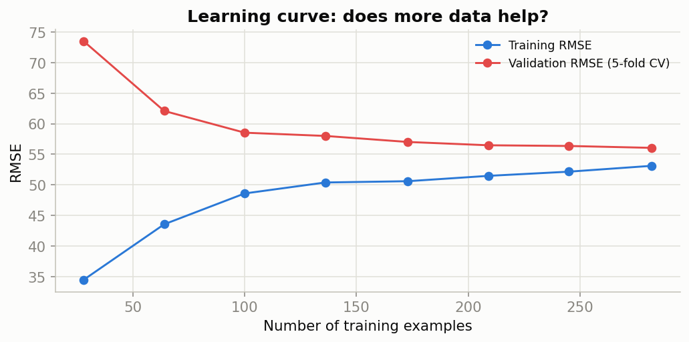

**Why this step exists — this is the single most useful chart for deciding what to do NEXT.** If the validation curve is still visibly dropping as training size increases, collecting more data would likely improve the model — a valuable, concrete answer to "should we spend money gathering more patient records?" Here, the curves have mostly converged and flattened, telling us **this specific dataset has hit its ceiling with a linear model** — more data of the same kind won't help much; the next lever to pull is better/more features, not more rows.

## Step 8 — Feature Importance

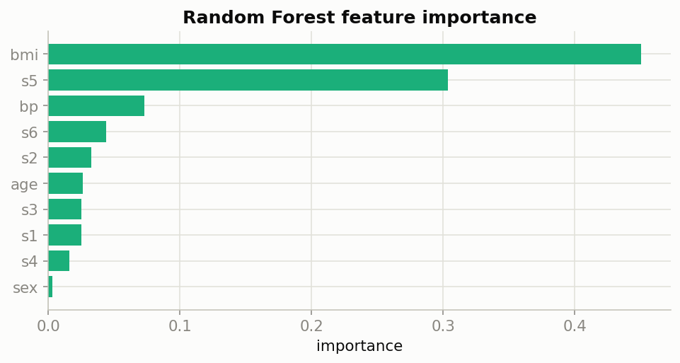

**Why this step exists:** Beyond just predicting accurately, stakeholders (here, clinicians) need to trust and understand *why* the model makes its predictions. Random Forest importance confirms `bmi` and `s5` dominate — consistent with the correlation analysis from Step 1, and consistent with established medical knowledge. When a model's "reasoning" lines up with domain expertise, that's a strong trust signal before deployment.

### Project 1 — Summary of Decisions & Why

| Decision | Why |
|---|---|
| Chose a small, clean, bundled dataset | Fully reproducible, fast to iterate, transparent for teaching |
| 80/20 train/test split | Standard default that balances enough training data with a trustworthy test estimate |
| Standardized features | Required for linear models' optimization to behave well, and a universal good habit |
| Compared 3 models of rising complexity | Empirically prove whether added complexity is worth the risk, rather than assuming |
| Capped Random Forest depth | Deliberately traded a little bias for much lower variance, given the small dataset |
| Reported MAE + RMSE + R² together | No single metric tells the full story alone |
| Plotted residuals | Catches structural problems (heteroscedasticity) invisible to a single summary number |
| Plotted a learning curve | Answers "should we collect more data?" with evidence, not guessing |

---

# Project 2 — Classification: Breast Cancer Diagnosis (Malignant vs. Benign)

**The business/scientific question:** Given 30 measurements taken from a digitized image of a breast mass (radius, texture, area, smoothness, etc.), can we predict whether a tumor is malignant or benign? This is a genuinely high-stakes classification problem, ideal for demonstrating why metric choice (Part B of the companion Statistics notes) matters so much.

**Why this dataset:** The real Wisconsin Diagnostic Breast Cancer dataset (569 real, anonymized patient samples), bundled with scikit-learn — a canonical binary classification benchmark used across countless ML courses.

## Step 1 — Load and Explore

```python
from sklearn.datasets import load_breast_cancer
data = load_breast_cancer(as_frame=True)
X = data.data
y = 1 - data.target   # relabel so 1 = malignant (the case we must never miss)
```

**Why we flip the label:** scikit-learn ships this dataset with `1 = benign`, which is backwards from the ML convention that "1 / positive" should represent the case you're most worried about missing. Flipping it makes every metric (especially Recall) read naturally: "Recall = how many actual malignant cases did we catch?"

**Class balance check:** 37.3% malignant, 62.7% benign — imbalanced enough that **Accuracy alone would already be a slightly risky metric to lead with** (see the companion Statistics notes, Part B.1).

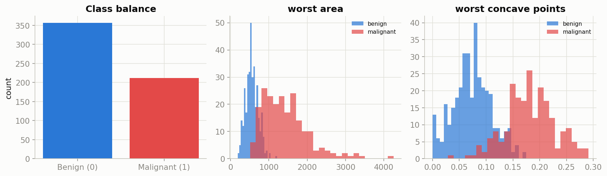

**Why we plot per-class feature histograms:** Notice `worst area` and `worst concave points` show almost completely separated distributions between benign (blue) and malignant (red) tumors. This is an extremely encouraging early sign — if the classes were completely overlapping on every feature, no model could ever separate them well, no matter how sophisticated.

## Step 2 — Split, Stratify, and Scale

```python
from sklearn.model_selection import train_test_split
X_train, X_test, y_train, y_test = train_test_split(
    X, y, test_size=0.25, random_state=7, stratify=y
)
```

**Why `stratify=y` — this is the critical addition versus Project 1:** Without stratification, a random split could accidentally put a disproportionate share of malignant cases into either the train or test set purely by chance, especially with an already-imbalanced target. Stratification forces both splits to preserve the original 37/63 class ratio, making the test score a fair, representative estimate.

## Step 3 — Train Two Different Model Families

```python
from sklearn.linear_model import LogisticRegression
from sklearn.ensemble import RandomForestClassifier

models = {
    "Logistic Regression": LogisticRegression(max_iter=5000),
    "Random Forest": RandomForestClassifier(n_estimators=300, max_depth=5, random_state=7),
}
```

**Why Logistic Regression as the primary baseline for a MEDICAL classification task:** Logistic Regression outputs a genuine, well-calibrated probability and produces interpretable coefficients ("this measurement increases malignancy odds by X") — both are extremely valuable in healthcare, where "the model said so" is never an acceptable explanation to a doctor or patient. Random Forest is trained alongside it as a non-linear challenger to see if it meaningfully outperforms the simpler, more interpretable option.

## Step 4 — Evaluate With the RIGHT Metrics (not just accuracy)

**Real results from this exact run (143 held-out patients):**

| Model | Accuracy | Precision | Recall | F1 | ROC-AUC |
|---|---|---|---|---|---|
| **Logistic Regression** | **0.979** | **1.000** | 0.943 | **0.971** | **0.996** |
| Random Forest | 0.930 | 0.957 | 0.849 | 0.900 | 0.973 |

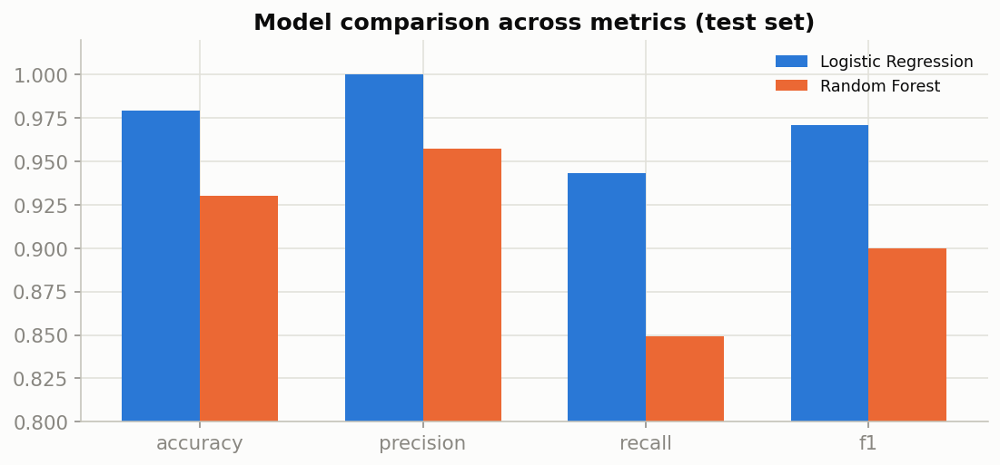

**Why Logistic Regression wins here, on EVERY metric:** This is a genuinely important, non-obvious lesson: the more complex model (Random Forest) does not always win. With clean, well-separated, well-understood tabular features like these, a simple linear boundary already separates the classes almost perfectly — Random Forest's extra flexibility just adds variance (overfitting risk) without adding value. **Always benchmark against the simplest reasonable model before reaching for something fancier.**

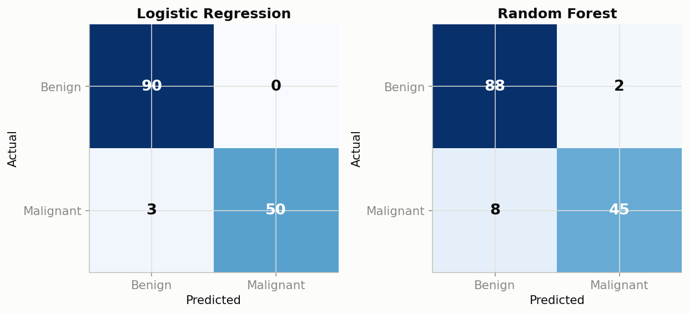

**Why we look at the confusion matrix, not just the F1 number:** The Logistic Regression model made **zero** False Positives (never wrongly told a benign patient they had cancer) and only **3** False Negatives (missed 3 real malignant cases out of 53). In a real deployment, those 3 missed cases are exactly where a human radiologist review process would need to serve as a safety net — the confusion matrix tells the *deployment* team precisely where to add human oversight, which a single F1 score never could.

## Step 5 — Threshold Tuning: The Precision-Recall Tradeoff in Practice

```python
from sklearn.metrics import precision_recall_curve
proba = model.predict_proba(X_test_s)[:, 1]
prec, rec, thresholds = precision_recall_curve(y_test, proba)
```

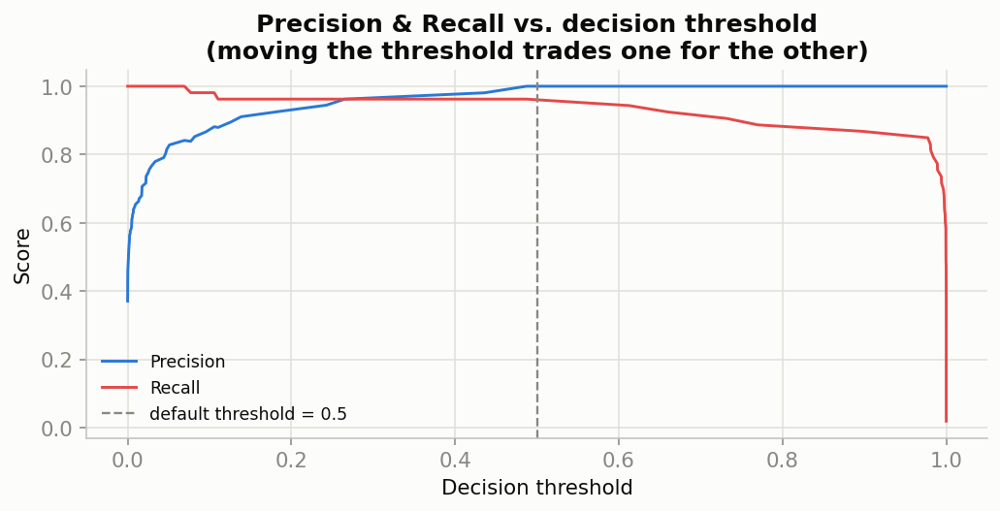

**Why this step exists, and why it's often skipped by beginners:** By default, scikit-learn classifies anything with probability ≥ 0.5 as positive. But 0.5 is an arbitrary default with no medical meaning. For a cancer screening tool, a hospital might deliberately **lower** the threshold to 0.3 to trade away some precision (a few more unnecessary follow-up biopsies) in exchange for higher recall (catching more real cancers) — because in this domain, a missed cancer is far more costly than an unnecessary follow-up test. This chart is what lets a team make that tradeoff decision **deliberately and quantitatively**, instead of blindly accepting scikit-learn's default.

## Step 6 — Feature Importance for Trust and Interpretability

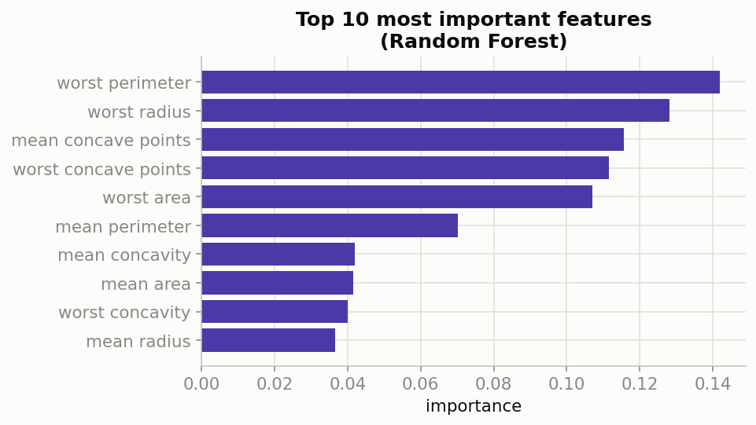

**Why this step exists:** Even though Random Forest didn't win on raw metrics, examining its feature importances is still valuable as a **cross-check**: do the top-ranked features (worst area, worst concave points, worst radius) match established medical knowledge about what makes a tumor concerning? They do — tumor size and concavity irregularity are well-known malignancy indicators. This kind of domain-alignment check is a required step before any healthcare model goes near a real clinical workflow.

### Project 2 — Summary of Decisions & Why

| Decision | Why |
|---|---|
| Flipped the label so 1 = malignant | Makes Recall/Precision read naturally for the case that matters most |
| Used `stratify=y` on the split | Preserves class balance in both train and test sets, given the imbalance |
| Compared Logistic Regression vs. Random Forest | Tests whether added model complexity is actually justified |
| Led with Precision/Recall/F1/ROC-AUC, not just Accuracy | Accuracy alone is misleading on imbalanced medical data |
| Plotted the confusion matrix explicitly | Shows exactly which mistakes were made, guiding where human review is needed |
| Tuned the decision threshold | The default 0.5 cutoff has no special medical meaning; the real tradeoff must be chosen deliberately |
| Checked feature importance against domain knowledge | A required trust/sanity check before any healthcare deployment |

---

# Project 3 — Image Classification: Handwritten Digit Recognition

**The business/scientific question:** Given a small grayscale image of a handwritten digit, can we correctly identify which digit (0-9) it is? This is the "hello world" of computer vision and neural networks — the same task family as the famous MNIST dataset, using a compact 8×8-pixel dataset from scikit-learn so it trains in seconds, fully offline, with no GPU or internet-downloaded dataset required.

**Why this dataset instead of full MNIST:** Full MNIST requires either an internet download or a deep learning framework like TensorFlow/PyTorch, neither of which was available in this offline environment. The `load_digits` dataset (1,797 real handwritten digit images, 8×8 = 64 pixels each) is the same underlying task and teaches every core concept identically — data representation, dimensionality, neural network training mechanics, and multi-class evaluation — just at a smaller scale that trains on a laptop CPU in seconds instead of minutes on a GPU.

## Step 1 — Understand What "Image Data" Actually Looks Like to a Model

```python
from sklearn.datasets import load_digits
digits = load_digits()
X, y = digits.data, digits.target   # X.shape = (1797, 64), y = digit label 0-9
```

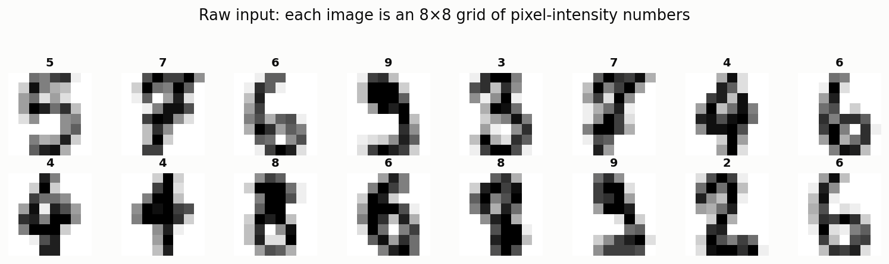

**Why this step exists — and this is the single most important conceptual leap in computer vision:** A human sees "a picture of a 5." A model sees none of that — it sees a grid of 64 numbers, each representing how dark or light one tiny square (pixel) is.

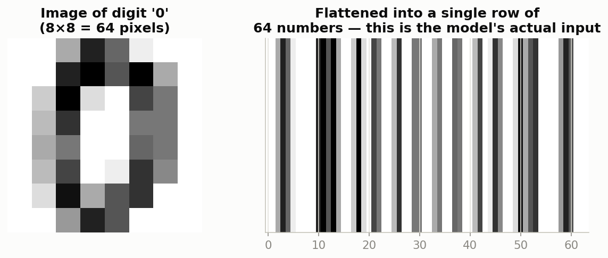

**Why we flatten the 8×8 image into a single row of 64 numbers:** Classic ML algorithms (and even the simple neural network we use below) expect input as a flat vector of numbers, not a 2D grid. This flattening step is exactly why a real Convolutional Neural Network (CNN) — the industry-standard architecture for full-size MNIST and real photos — is such an important later upgrade: a CNN specifically preserves and exploits the *2D spatial structure* (which pixels are next to which) that flattening throws away. For this small, centered, low-resolution dataset, a flattened approach still works well; for large, complex real-world images, it would not, and a CNN becomes necessary.

## Step 2 — Can 64 Dimensions Even Be Visualized? (PCA)

```python
from sklearn.decomposition import PCA
pca = PCA(n_components=2).fit(X_train_scaled)
X_2d = pca.transform(X_train_scaled)
```

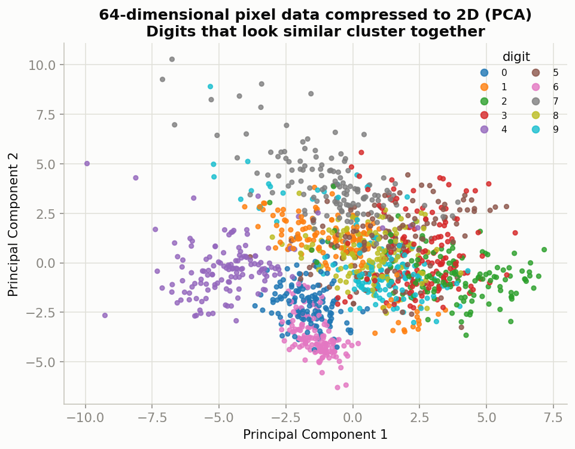

**Why this step exists:** Humans can't visualize 64 dimensions directly. **Principal Component Analysis (PCA)** compresses the data down to the 2 directions that capture the most variation, purely for visualization and intuition (we do NOT train the final model on this compressed version — that would throw away useful information). Seeing that same-digit points already cluster together even in this crude 2D squash is a strong, encouraging early signal that the full 64-dimensional data should be very learnable.

## Step 3 — Split, Scale, and Train a Neural Network

```python
from sklearn.model_selection import train_test_split
from sklearn.preprocessing import StandardScaler
from sklearn.neural_network import MLPClassifier

X_train, X_test, y_train, y_test = train_test_split(X, y, test_size=0.25, random_state=42, stratify=y)
scaler = StandardScaler().fit(X_train)
X_train_s, X_test_s = scaler.transform(X_train), scaler.transform(X_test)

mlp = MLPClassifier(hidden_layer_sizes=(64, 32), max_iter=500, random_state=42, alpha=1e-3)
mlp.fit(X_train_s, y_train)
```

**Why `stratify=y` again here:** With 10 classes instead of 2, it's even easier for a random split to accidentally under-represent one digit in the test set — stratification guarantees roughly equal representation of every digit (0 through 9) in both splits.

**Why a Multi-Layer Perceptron (a basic neural network) here specifically:** This is the perfect small-scale demonstration of the exact "learning via gradient descent" mechanics described in the companion Statistics notes — an MLP literally is layers of weighted sums and non-linear activation functions, trained by backpropagating the error and nudging weights via gradient descent. `hidden_layer_sizes=(64, 32)` means two hidden layers (64 neurons, then 32) between the 64 input pixels and the 10 output digit classes — deliberately small since this dataset itself is small, again respecting the bias-variance tradeoff.

**Why we also train an SVM for comparison:**

```python
from sklearn.svm import SVC
svm = SVC(kernel="rbf", gamma="scale").fit(X_train_s, y_train)
```

Support Vector Machines with an RBF kernel are historically extremely strong on small, clean image datasets like this one — comparing against them tells us whether the neural network's added complexity is actually earning its keep, exactly the same "don't assume, verify" principle from Projects 1 and 2.

**Real results from this exact run (450 held-out test images):**
- Neural Network (MLP): **96.7%** accuracy
- **SVM (RBF kernel): 98.0%** accuracy — the winner

## Step 4 — Watch the Network Actually Learn

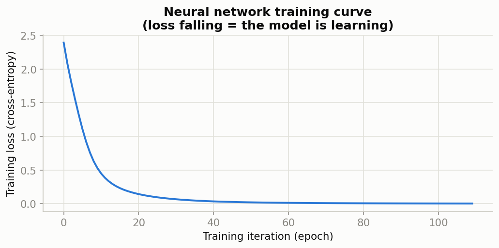

**Why this step exists — this chart IS the "how does a machine learn" mechanism made visible.** Each point is one training epoch. The steadily falling loss is literally gradient descent in action: the network's internal weights are being nudged, iteration by iteration, in the direction that reduces prediction error, exactly as described mechanically in the companion Statistics notes (Part on optimization). If this curve had stayed flat, it would mean the learning rate was likely too low or the network too constrained; if it had oscillated wildly, the learning rate would likely be too high.

## Step 5 — Full Multi-Class Confusion Matrix

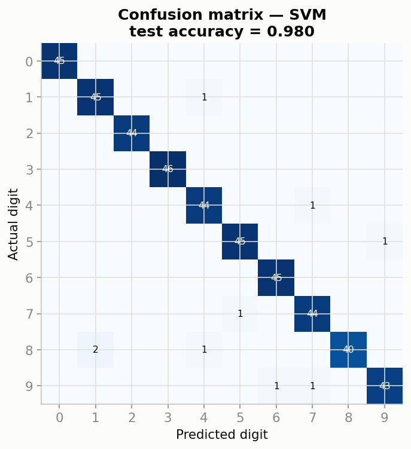

**Why a confusion matrix still matters with 10 classes, not just 2:** It immediately shows *which specific digits* the model confuses with each other, not just an overall accuracy number. This is far more actionable — e.g., if the matrix showed heavy confusion specifically between 4s and 9s (a very common real-world digit confusion due to their visual similarity), the team would know exactly where to focus effort (perhaps collecting more examples of that specific pair, or adding a feature that specifically distinguishes them).

## Step 5b — Reporting Metrics Honestly Across 10 Classes

```python
from sklearn.metrics import classification_report, precision_score
print(classification_report(y_test, y_pred, digits=3))
print(precision_score(y_test, y_pred, average="macro"))
print(precision_score(y_test, y_pred, average="micro"))
print(precision_score(y_test, y_pred, average="weighted"))
```

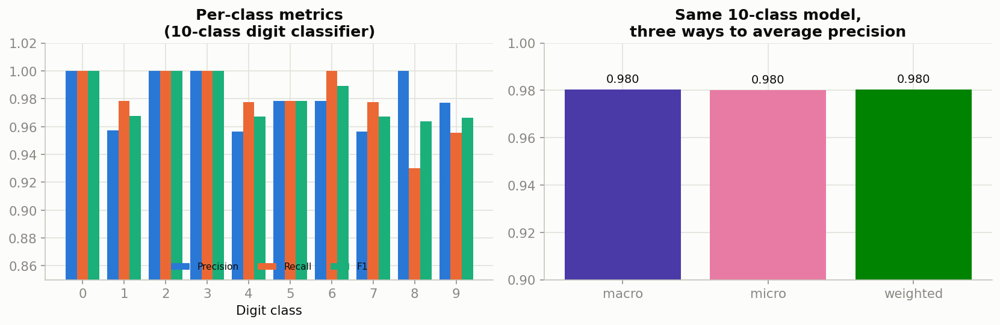

**Why one overall "98% accuracy" number is not the end of the story with 10 classes:** The left panel above breaks Precision/Recall/F1 out *per digit*. Digit "8" stands out with the lowest Recall (93%) of any class — meaning of all the true 8s in the test set, the model missed the largest share specifically for that digit (consistent with the confusion matrix above, where 8 is genuinely one of the visually messiest handwritten digits to distinguish from 3, 9, and 0). Reporting only the single blended accuracy number would have completely hidden this specific, actionable weak spot.

**Why we compute macro, micro, AND weighted precision, not just one:** As explained in the companion Statistics notes (Part B.1), these three answer subtly different questions. Here they land within a hair of each other (0.980 macro, 0.980 micro, 0.980 weighted) *specifically because* this dataset is nearly perfectly class-balanced (about 45 examples per digit) — a useful confirmation that our stratified train/test split (Step 3) worked as intended. On a real-world multi-class problem with skewed class frequencies (e.g., a defect-classification system where 9 defect types are common and 1 is rare), these three numbers would diverge meaningfully, and the choice of which one to lead with becomes a real business decision: macro-average if the rare defect type matters just as much as common ones (often true in safety-critical inspection), weighted-average for a realistic blended summary, or per-class metrics reported individually so nothing is hidden in an aggregate at all.

## Step 6 — Look at the Actual Mistakes

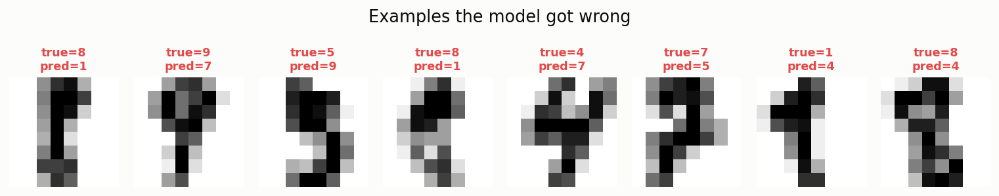

**Why this step exists, and why it's the most important "sanity check" step of the entire project:** Aggregate metrics can hide the fact that a model's mistakes are either "reasonable" (a genuinely ambiguous, messily-written digit that a human might also misread) or "alarming" (confusing a completely different, clearly-formed digit — a sign of a real underlying model problem). Manually inspecting misclassified examples is a required step before any image classifier ships, because it's the only way to tell those two situations apart.

### Project 3 — Summary of Decisions & Why

| Decision | Why |
|---|---|
| Used a compact 8×8 digit dataset instead of full MNIST | No internet/GPU/deep-learning framework required, identical core concepts, offline-reproducible |
| Flattened images into 64-number vectors | Required input format for classic ML/MLP; explicitly discussed as the exact limitation a real CNN later fixes |
| Used PCA purely for visualization | Humans can't see 64 dimensions; PCA is a diagnostic tool here, not part of the trained pipeline |
| Stratified the split across 10 classes | Prevents any single digit from being under-represented in train or test |
| Compared a Neural Network against an SVM | Tests whether the neural network's complexity is actually justified on this small dataset |
| Plotted the training loss curve | Makes the abstract "gradient descent" learning mechanism directly visible and verifiable |
| Inspected individual misclassified images | Aggregate accuracy can hide whether mistakes are reasonable or alarming — only manual inspection reveals which |
| Reported per-class metrics plus macro/micro/weighted averages | A single blended accuracy number can hide a weak spot on one specific class (digit "8" here); the averaging choice itself becomes a real decision on imbalanced multi-class problems |

---

## Cross-Project Takeaways (What All Three Projects Teach in Common)

1. **EDA always comes first** — in every project, we looked at the data's shape, distribution, and class balance before writing a single line of modeling code.
2. **Always split before touching the model, and never let information leak across that split** — scalers were always `fit()` only on training data; splits were stratified whenever the target was imbalanced or multi-class.
3. **Always benchmark simple models before complex ones** — in Projects 1, 2, and 3, the simplest model (Linear Regression, Logistic Regression, or SVM) was competitive with or better than a more complex alternative (Random Forest, Neural Network). This is one of the most common surprises for beginners, and one of the most important lessons for a working ML engineer: **complexity must be earned with evidence, never assumed.**
4. **The right metric depends entirely on the cost of being wrong** — regression used MAE/RMSE/R², balanced classification leaned on Precision/Recall/F1/ROC-AUC, and clustering (see the companion Statistics notes) uses entirely different, label-free metrics. Picking a metric is a business decision, not a technical afterthought.
5. **Every chart in this document answers a specific question a plain metric cannot** — residual plots catch structural bias, learning curves answer "would more data help," confusion matrices show exactly which mistakes are being made, and misclassified-example galleries reveal whether those mistakes are reasonable or alarming. A single number is never the whole story.
