# Traffic Sign Recognition Using a From-Scratch Feed-Forward Neural Network

### A study of the German Traffic Sign Recognition Benchmark using a multi-layer perceptron implemented without machine learning frameworks

*A project report submitted in partial fulfilment of the requirements for the degree of Master of Science*

**Author:** Bibek Ghimire  
**Institution:** _[fill in institution name]_  
**Supervisor:** _[fill in supervisor name]_  
**Submission date:** _[fill in submission date]_

---

> **STATUS OF THIS DOCUMENT**
>
> Complete. Section 7 reports the final experiments: 54 training runs (18 configurations × 3 seeds) on the corrected code, with paired significance tests. A first single-seed round on the original code (Phase 1) exposed several further implementation defects. It is kept in Appendix D, and its effect is quantified in Section 7.7. The trained models, logs, predictions and figures behind every number are in `models/` and `results/`. The title-page fields (institution, supervisor, date) and the declaration still need to be filled in.


---

<!-- DOCX:START -->

## Declaration

I declare that this report is my own work, that it has not been submitted for any other degree or qualification, and that all sources used have been acknowledged. _[Check this wording against your institution's required declaration and sign it.]_

Signed: ____________________  Date: ____________

## Acknowledgements

_[Optional: thank your supervisor and anyone else who supported the project.]_

The from-scratch network, metric and augmentation code builds on an earlier MNIST hand-written digit recognition project (see README, Credits). GTSRB is published by the Institut für Neuroinformatik, Ruhr-Universität Bochum, under CC BY 4.0.

## Abstract

Traffic sign recognition is a core perception task in driver assistance and
autonomous driving, and one where the cost of a misclassification is
asymmetric: mistaking a speed limit sign for another speed limit sign is a
different kind of failure from missing a stop sign entirely. This report
presents a traffic sign classifier for the German Traffic Sign Recognition
Benchmark (GTSRB) — 51,839 images across 43 classes — built on a fully
connected feed-forward neural network implemented from first principles in
NumPy. No machine learning framework is used: forward propagation,
backpropagation, the Adam optimizer, inverted dropout, L2 regularization, He
initialization and early stopping are each derived and implemented directly.

The contribution is not benchmark performance. A fully connected network
operating on flattened pixels lacks both translation invariance and any notion
of spatial locality, and is therefore structurally disadvantaged against the
convolutional architectures that define the state of the art on this dataset.
The contribution is instead a complete, inspectable and reproducible
implementation of the underlying mechanics, together with an experimental
design that isolates the contribution of each component — initialization
scheme, optimizer, regularizer, network depth and data augmentation — and an
honest characterisation of where the architecture's ceiling lies and why.

A methodological finding is reported independently of any training run: three
transformation choices inherited from the digit-recognition domain are
demonstrably invalid for traffic signs. Horizontal mirroring, standard in
digit and general-object augmentation, systematically produces mislabelled
examples for the eight directional sign classes in GTSRB, since a mirrored
"Turn left ahead" is a valid image of "Turn right ahead" carrying the wrong
label.

Over three seeds on the official test set, the baseline network ([1024, 512, 256, 43], Adam, dropout) reaches 87.80 ± 0.49% test accuracy and a macro-F1 of 0.839 ± 0.007. Halving the learning rate every 10 epochs raises this to 89.68 ± 0.67% accuracy and 0.866 ± 0.009 macro-F1; training on five augmented variants per image reaches 90.88 ± 0.11% and 0.874 ± 0.003. Both improvements are consistent across seeds. Initialisation, network width and depth, and the dropout rate within 0.7–0.8 made no consistent difference. Plain gradient descent matched Adam once its learning rate was tuned. Most errors (80%) fall within two visually homogeneous families, the speed limits and the triangular warning signs, and signs smaller than 30 px are classified markedly worse. This is the error structure expected of a fully connected network without spatial priors. The experiments also exposed implementation defects that silently distorted the results or the cost: a mis-normalised L2 penalty, an inactive learning-rate schedule, per-epoch re-seeding of the global RNG, a track-leaking validation split that overstated accuracy by 4–8 points, float64 upcasting with a memory blow-up, and a float32 subnormal slow-down. All are corrected, and training is now 2.4× faster.


**Keywords:** traffic sign recognition, GTSRB, multi-layer perceptron,
backpropagation, Adam optimization, dropout, data augmentation, class
imbalance, McNemar test, reproducibility

---

<!-- DOCX:TOC -->

## Table of contents

1. [Introduction](#1-introduction)
2. [Related work](#2-related-work)
3. [Dataset](#3-dataset)
4. [Methodology](#4-methodology)
5. [Experimental setup](#5-experimental-setup)
6. [Evaluation metrics](#6-evaluation-metrics)
7. [Results](#7-results)
8. [Discussion](#8-discussion)
9. [Limitations and threats to validity](#9-limitations-and-threats-to-validity)
10. [Conclusion and future work](#10-conclusion-and-future-work)
- [References](#references)
- [Appendix A — Reproducibility](#appendix-a--reproducibility)
- [Appendix B — Class index](#appendix-b--class-index)
- [Appendix C — Notation](#appendix-c--notation)
- [Appendix D — Phase 1 results (original code)](#appendix-d--phase-1-results-original-code)

---

## 1. Introduction

### 1.1 Background

Automatic traffic sign recognition sits in the perception layer of advanced
driver assistance systems and autonomous vehicles. The task is superficially
easy — signs are standardised, high-contrast, and designed by regulation to be
legible at distance — and in practice hard, because the images a vehicle
actually captures are degraded in ways the designers never intended: motion
blur, low sun, night, rain, partial occlusion by foliage, faded or vandalised
faces, and severe perspective distortion when a sign is approached off-axis.

Stallkamp et al. [1] established the German Traffic Sign Recognition Benchmark
in 2011 to make these methods comparable. Their headline result is worth
restating, because it sets the bar: human classification accuracy on GTSRB is
98.84%, and the best submitted machine learning system exceeded it at 99.46%,
using a committee of convolutional neural networks [2]. Traffic sign
recognition is thus one of the earliest vision tasks on which machines
demonstrably surpassed human performance.

### 1.2 Problem statement

Given a cropped image containing exactly one German traffic sign, assign it to
one of 43 classes. This is a **closed-set, single-label classification**
problem. It is explicitly *not* detection: locating signs within a full street
scene is a distinct problem requiring a different class of model, and is out of
scope (see Section 9.2).

### 1.3 Motivation for the approach

Modern frameworks make it possible to train an accurate classifier without
understanding what the training loop does. That convenience has a cost in
educational settings: the gradient computation, the optimizer's state, the
behavioural difference between dropout at training and at inference time — all
of it is behind an API.

This project takes the opposite approach deliberately. Every component is
implemented in NumPy and can be inspected, unit-checked, and reasoned about
line by line. The accompanying notebook (`Project_Walkthrough.ipynb`) executes
each stage of a training step in isolation so that the intermediate tensors are
directly observable.

The cost of this choice is accepted openly: the architecture cannot compete
with a convolutional model on this dataset. Section 8.4 quantifies why, and
Section 10.2 sets out the path to closing the gap.

### 1.4 Objectives

1. Implement a complete multi-layer perceptron in NumPy — forward propagation,
   backpropagation, Adam, dropout, L2, He initialization, early stopping and
   learning rate scheduling — with no machine learning framework.
2. Build a preprocessing pipeline that adapts GTSRB's variable-size, variable-
   exposure colour photographs into fixed-length feature vectors.
3. Design and specify a controlled experimental protocol isolating the effect
   of each architectural and training choice.
4. Evaluate with metrics appropriate to an imbalanced multi-class problem,
   rather than accuracy alone.
5. Establish which augmentation transformations are valid in the traffic sign
   domain, as opposed to inherited unexamined from other image domains.
6. Deliver the whole thing reproducibly: pinned dependencies, a container
   definition, and a documented single-command path from clean checkout to
   trained model.

### 1.5 Scope

**In scope:** classification of pre-cropped single signs; grayscale
preprocessing; fully connected architectures; the training and regularization
methods listed above; offline data augmentation; per-class evaluation.

**Out of scope:** sign detection or localisation; video and temporal
tracking; convolutional, recurrent or attention-based architectures; real-time
embedded deployment; colour-channel modelling (see Section 9.1).

### 1.6 Contributions

- **C1.** A complete framework-free implementation of a trainable MLP,
  documented to the level of individual equations (Section 4).
- **C2.** A GTSRB preprocessing pipeline with each stage justified against a
  specific property of the data (Section 4.2).
- **C3.** A domain analysis of augmentation validity, identifying horizontal
  mirroring as label-corrupting for this dataset and correcting two
  transformation ranges inherited from the digit domain (Section 4.10).
- **C4.** A controlled experimental protocol of six ablations (Section 5.4).
- **C5.** Ten defects identified and corrected. Three are in the antecedent
  digit-recognition codebase, and seven were exposed by the experiments
  (Phase 1, Appendix D, and Phase 2). Several are silently wrong rather than loudly
  wrong (Section 4.10).
- **C6.** A three-seed evaluation of the full protocol with paired
  significance tests (McNemar), per-class and error-slice analysis, and a
  calibration study (Sections 7–8).
- **C7.** Measured resource characterisation: training speed, memory and
  inference latency, including a 2.4× training speed-up from the numerical
  changes (Sections 5.1, 7.6).
- **C8.** A reproducible artefact: pinned container, unit tests with a
  numerical gradient check, one-command experiment runner, raw results for
  every run, and a repository map with architecture and data-flow diagrams.

---

## 2. Related work

### 2.1 The benchmark and its results

GTSRB was introduced as a competition at IJCNN 2011 [1]. The final standings
are instructive about what matters on this task:

| Rank | Method | Accuracy | Note |
|---|---|---|---|
| 1 | Committee of CNNs [2] | 99.46% | Ensemble of 25 networks |
| 2 | **Human performance** [1] | **98.84%** | Measured over 32 test subjects |
| 3 | Multi-scale CNN [3] | 98.31% | Features from multiple layers to the classifier |
| 4 | Random forests | 96.14% | On HOG features |
| 5 | LDA on HOG | 95.68% | Classical baseline |

Two things follow. First, convolutional architectures dominate the top of the
table decisively. Second, even the classical HOG-based methods clear 95%,
which sets a meaningful reference point: a method that cannot beat LDA on HOG
features is not exploiting the structure of the problem.

### 2.2 Classical approaches

Before CNNs, GTSRB systems were pipelines of hand-designed features and a
conventional classifier. Histogram of Oriented Gradients (HOG) [4] was the
dominant descriptor, capturing local edge orientation statistics — well matched
to signs, whose identity is largely carried by shape and pictogram outline.
Colour segmentation in HSV space was often used as a first-stage filter,
exploiting the regulatory colour coding (red for prohibitory, blue for
mandatory, yellow for temporary).

The relevance to this work is that these methods succeed by *engineering
translation robustness into the features*. A fully connected network on raw
pixels has neither engineered features nor learned translation invariance,
which is precisely the deficit analysed in Section 8.4.

### 2.3 Convolutional approaches

Ciresan et al. [2] won the benchmark with a committee of deep CNNs trained on
augmented data. Sermanet and LeCun [3] introduced a multi-scale architecture
feeding both early and late convolutional stages to the classifier, on the
argument that traffic sign identity depends on both fine detail (the digits
inside a speed limit sign) and coarse shape (the sign's outline). Their result
also established that grayscale input costs surprisingly little accuracy on
GTSRB relative to full colour — a finding this project's preprocessing relies
on (Section 4.2).

### 2.4 Multi-layer perceptrons on image data

The theoretical position of the MLP is well established. The universal
approximation theorem [5] guarantees that a single hidden layer of sufficient
width can approximate any continuous function on a compact domain — so
representational capacity is not the binding constraint here. The binding
constraint is **sample efficiency**. A fully connected layer treats input
position 100 and position 101 as unrelated coordinates. It must therefore learn
the appearance of a sign separately at every position it can occupy, and every
such position requires its own training examples. LeCun et al. [6] identified
this as the motivation for weight sharing in convolutional networks.

The methods this implementation uses are individually standard: He
initialization [7], scaled for the ReLU nonlinearity; the Adam optimizer [8],
combining momentum with per-parameter adaptive step sizes; and inverted dropout
[9] as a stochastic regularizer.

### 2.5 Positioning of this work

This project does not aim to advance the state of the art on GTSRB, and it
would be dishonest to present it as doing so. It occupies the pedagogical
position: a complete, transparent implementation of the mechanics that
frameworks abstract, applied to a real dataset with real difficulties, together
with an experimental design that makes the resulting limitations legible rather
than mysterious.

---

## 3. Dataset

### 3.1 Description

The German Traffic Sign Recognition Benchmark [1] is published by the Institut
für Neuroinformatik, Ruhr-Universität Bochum, under CC BY 4.0.

| Property | Value |
|---|---|
| Classes | 43 |
| Training images | 39,209 |
| Test images | 12,630 |
| Total | 51,839 |
| Format | PPM (uncompressed RGB) |
| Image dimensions | Variable, 15×15 to 250×250 px |
| Annotation | Per-image ROI bounding box and class id, semicolon-delimited CSV |
| Colour | 24-bit RGB |
| Licence | CC BY 4.0 |

### 3.2 Provenance and structure

Images were extracted from roughly 10 hours of video recorded on German roads.
Critically, **each physical sign contributes a track of 30 consecutive frames**
as the vehicle approaches it. Frames within a track are highly correlated: they
differ mainly in scale and slightly in viewing angle.

This has a direct methodological consequence. Randomly splitting the training
set into training and validation partitions places frames of the *same physical
sign* on both sides of the split, so validation accuracy is optimistically
biased. The official train/test partition is track-disjoint and does not suffer
from this. The first round of experiments (Phase 1, Appendix D) used a random
split and measured the bias directly: dev accuracy exceeded test accuracy by
4–8 points in every configuration that trained properly. The final protocol (Section 5.3) therefore
holds out **whole tracks**. The training files are named `TTTTT_FFFFF.ppm`
(track, frame), which makes a track-disjoint dev split straightforward.

### 3.3 Class distribution

The dataset is materially imbalanced. Training images per class range from 210
(class 0, "Speed limit 20") to 2,250 (class 2, "Speed limit 50") — a ratio of
roughly 10.7:1. The distribution reflects real-world sign frequency rather than
sampling error, which is arguably the right choice for a benchmark but makes
accuracy a poor headline metric (Section 6.1).

The distribution can be plotted with `visualize_data_distribution(train_y, "training")` (`src/dataset.py`).

### 3.4 Sources of difficulty

| Source | Description | Mitigation in this work |
|---|---|---|
| Illumination | Tunnels, direct sun, dusk, headlights | Histogram equalization (§4.2) |
| Scale | 15×15 to 250×250 px | Resize to fixed 32×32 (§4.2) |
| Motion blur | Vehicle in motion | Blur augmentation (§4.10) |
| Perspective | Off-axis approach | Partially, via rotation and shift (§4.10) |
| Occlusion | Foliage, stickers, poles | **Not addressed** |
| Inter-class similarity | Speed limits differ only in digits | **Architectural limitation** (§8.4) |
| Class imbalance | 10.7:1 | Reported per class (§6); **not corrected** |
| Physical degradation | Fading, vandalism, damage | **Not addressed** |

The three "not addressed" entries are stated deliberately. They are known
weaknesses of this system, not oversights.

---

## 4. Methodology

### 4.1 System overview

```
    Raw .ppm                Preprocessing              Network              Output
   ┌──────────┐   ┌───────────────────────────┐   ┌─────────────┐   ┌──────────────┐
   │ variable │   │ ROI crop                  │   │  1024       │   │  43 softmax  │
   │ size RGB │──▶│ grayscale                 │──▶│  ↓ 512 ReLU │──▶│ probabilities│
   │ + ROI    │   │ histogram equalize        │   │  ↓ 256 ReLU │   │  → argmax    │
   │ + label  │   │ resize 32×32              │   │  ↓  43      │   │  → 2nd guess │
   └──────────┘   │ flatten → 1024, ÷255      │   └─────────────┘   └──────────────┘
                  └───────────────────────────┘
```

The implementation is four modules with an acyclic import graph (arrows point
from a module to what it imports):

```
ffnn.py ──▶ model_utils.py ──▶ dataset.py ◀── data_augmentation.py ──▶ model_utils.py
```

`dataset.py` has no project dependencies and owns everything from acquisition
to encoding. `ffnn.py` contains only the network and depends only on
`model_utils.py`. The five entry scripts (`train.py`, `evaluate.py`,
`predict.py`, `augment.py`, `gui.py`) wire these modules together. The
architecture and data-flow diagrams in `docs/architecture/` give the full picture.

**Data representation.** All matrices are **column-major**: the design matrix
$X \in \mathbb{R}^{n \times m}$ has features down the rows and examples across
the columns, and labels $Y \in \{0,1\}^{43 \times m}$ likewise. A mini-batch is
therefore a contiguous column slice, and the forward pass is a single matrix
product per layer with no transposition.

### 4.2 Preprocessing

Each image undergoes five deterministic transformations. Each is justified
against a specific property of GTSRB rather than adopted by convention.

**1. Crop to the annotated ROI.** GTSRB supplies a bounding box per image; the
raw file carries approximately 10% background margin beyond it. Since a fully
connected network assigns an independent weight to every input coordinate, that
margin is 20–30% of the input budget spent on pixels containing, by
construction, no signal. The crop reclaims it.

**2. Convert to grayscale.** Retaining RGB triples the first layer's parameter
count — from 524,288 to 1,572,864 weights at the default width — for
information that is largely redundant with shape. Sermanet and LeCun [3] report
that grayscale costs little accuracy on GTSRB. This is a considered trade-off,
not a free choice, and Section 9.1 records what it gives up.

**3. Histogram equalization.** The highest-value step in the pipeline for this
dataset. GTSRB's illumination range is extreme, and equalization redistributes
each image's intensity histogram towards uniform, so that a tunnel exposure and
a noon exposure of the same sign present comparable inputs. Without it the
network must devote capacity to learning illumination invariance from data.

**4. Resize to 32×32 bilinear.** A fixed input dimension is required. 32×32 is
chosen as the smallest size retaining the pictogram detail that separates
visually adjacent classes, at 1,024 features. 28×28 (the MNIST convention)
degrades speed limit digits; 48×48 raises the first layer to 1.18M weights for
marginal detail gain.

**5. Flatten and scale.** $(32,32) \rightarrow (1024,1)$, divided by 255 to
place every feature in $[0,1]$. Unnormalised inputs in $[0,255]$ produce first-
layer gradients two orders of magnitude larger than later layers', which forces
a learning rate too small for the rest of the network.

Labels are one-hot encoded to $\{0,1\}^{43}$.

### 4.3 Network architecture

An $L$-layer fully connected network with widths
$[1024, h_1, \ldots, h_{L-1}, 43]$; the default is $[1024, 512, 256, 43]$.

| Layer | Shape of $W$ | Shape of $b$ | Parameters | Activation |
|---|---|---|---|---|
| 1 | (512, 1024) | (512, 1) | 524,800 | ReLU |
| 2 | (256, 512) | (256, 1) | 131,328 | ReLU |
| 3 | (43, 256) | (43, 1) | 11,051 | Softmax |
| | | **Total** | **667,179** | |

ReLU is used on hidden layers for its non-saturating gradient; softmax on the
output to produce a normalised distribution over the mutually exclusive
classes.

### 4.4 Weight initialization

He initialization [7]:

$$W^{[l]} \sim \mathcal{N}\!\left(0, \frac{2}{n^{[l-1]}}\right), \qquad b^{[l]} = 0$$

The factor $2/n^{[l-1]}$ preserves activation variance across a ReLU layer.
Since ReLU zeroes half its input in expectation, halving the variance, the
factor 2 compensates; without it, activation magnitude decays geometrically
with depth and deep networks train slowly or not at all. Biases start at zero
because the weights already break symmetry.

The alternative implemented for comparison is $W \sim 0.01 \cdot
\mathcal{N}(0,1)$, a depth-independent scale. Experiment E1 (Section 5.4)
quantifies the difference.

### 4.5 Forward propagation

For $l = 1 \ldots L-1$:

$$Z^{[l]} = W^{[l]} A^{[l-1]} + b^{[l]}, \qquad A^{[l]} = \max(0, Z^{[l]})$$

with $A^{[0]} = X$, and at the output layer:

$$Z^{[L]} = W^{[L]} A^{[L-1]} + b^{[L]}, \qquad
\hat{Y}_{k,i} = \frac{e^{Z^{[L]}_{k,i} - \max_j Z^{[L]}_{j,i}}}
{\sum_{c} e^{Z^{[L]}_{c,i} - \max_j Z^{[L]}_{j,i}}}$$

The subtraction of the column maximum is a numerical necessity, not a
refinement: raw logits of even modest magnitude overflow the exponential in
double precision. Subtracting the maximum leaves the softmax mathematically
unchanged while bounding every exponent at zero.

**Caching.** Each layer stores $(A^{[l-1]}, W^{[l]}, b^{[l]})$ and $Z^{[l]}$ on
the forward pass. Backpropagation requires exactly these; recomputing them
would double the cost of a training step.

### 4.6 Loss function

Categorical cross-entropy over $m$ examples:

$$J = -\frac{1}{m}\sum_{i=1}^{m}\sum_{k=1}^{43} Y_{k,i} \log \hat{Y}_{k,i}$$

Since $Y$ is one-hot, only the true class contributes: the loss is the negative
log-probability assigned to the correct answer.

**Computation from logits.** Evaluating $\log(\text{softmax}(z))$ in two steps
risks $\log(0)$ once the network becomes confident and a probability underflows
to zero. The implementation instead uses the algebraically equivalent but
numerically stable form

$$\log \hat{y}_k = z_k - \max_j z_j - \log\sum_c e^{z_c - \max_j z_j}$$

which cannot underflow. This is why the caches retain $Z$ rather than only $A$.

With L2 regularization the objective gains

$$J_{L2} = J + \frac{\lambda}{2N}\sum_{l=1}^{L}\|W^{[l]}\|_F^2$$

where $N$ is the **training-set size**. The inherited code divided by the
mini-batch size $m$ instead. That makes the effective penalty depend on the
batch size ($m = 128$ here) and makes a given $\lambda$ about 270 times stronger
than intended. Phase 1 measured the consequence (Appendix D): every $\lambda$ in
the planned grid under-fitted. The final code divides by $N$ by default
(`--l2-norm dataset`), and `--l2-norm batch` reproduces the original behaviour.

### 4.7 Backpropagation

The derivation follows the standard treatment [10]. At the output layer, the softmax and cross-entropy derivatives compose to

$$dZ^{[L]} = \hat{Y} - Y$$

which is why the softmax branch of the backward activation is an identity pass-
through. Then for $l = L \ldots 1$:

$$dW^{[l]} = \frac{1}{m} dZ^{[l]} A^{[l-1]T} + \frac{\lambda}{N}W^{[l]}, \qquad
db^{[l]} = \frac{1}{m}\sum_{i} dZ^{[l]}_{:,i}, \qquad
dA^{[l-1]} = W^{[l]T} dZ^{[l]}$$

and through the ReLU,

$$dZ^{[l]} = dA^{[l]} \odot \mathbb{1}[Z^{[l]} > 0]$$

**Shape assertions.** Every gradient must match the shape of its parameter, and
this is asserted at the point of computation. NumPy broadcasting will silently
produce a wrongly-shaped but valid array from a transposition error, and the
resulting failure surfaces many layers later as poor convergence rather than as
an exception. Asserting at the source converts a silent bug into a loud one.

**Numerical gradient check.** Shape assertions cannot catch a gradient with the
right shape and the wrong value. The test suite (`tests/test_core.py`) therefore
compares every analytic gradient with a central finite difference,
$(J(\theta+\epsilon)-J(\theta-\epsilon))/2\epsilon$ with $\epsilon = 10^{-6}$, on a
small float64 network, with and without L2. The worst relative error is below
$4\times10^{-8}$ (Section 7.0), so backpropagation is correct to numerical
precision.

### 4.8 Optimization

**Adam** [8], with per-parameter first and second moment estimates:

$$v_t = \beta_1 v_{t-1} + (1-\beta_1) dW_t, \qquad
s_t = \beta_2 s_{t-1} + (1-\beta_2) dW_t^2$$

Both are initialised at zero and are therefore biased towards zero early in
training; the bias-corrected estimates are

$$\hat{v}_t = \frac{v_t}{1-\beta_1^t}, \qquad \hat{s}_t = \frac{s_t}{1-\beta_2^t}$$

giving the update

$$W_t = W_{t-1} - \alpha\frac{\hat{v}_t}{\sqrt{\hat{s}_t}+\epsilon}$$

Defaults $\beta_1 = 0.9$, $\beta_2 = 0.999$, $\epsilon = 10^{-8}$. The counter
$t$ increments **per mini-batch, not per epoch**, and is never reset — the bias
correction is defined in terms of the number of updates applied.

Three alternatives are implemented for comparison: batch gradient descent
(mini-batch = $m$), stochastic gradient descent (mini-batch = 1), and
mini-batch gradient descent without adaptivity.

**Learning rate scheduling** is a step decay, $\alpha_e = \alpha_0\,\gamma^{\lfloor e/k\rfloor}$
with $\gamma = 0.5$ by default: the rate halves every $k$ epochs. The inherited
schedule computed $\alpha/(1+\delta e)$ with $\delta = \alpha/((e+1)/E)$. With
$\alpha = 10^{-3}$ that lowered the rate by only about 10% over 40 epochs, so it was
close to a no-op (measured in Phase 1, Appendix D).

**Numerical precision and efficiency.** Inputs and parameters are stored in
float32. The Adam update is computed in place with Python-float bias-correction
coefficients: with NumPy ≥ 2, dividing float32 arrays by NumPy float64 scalars
silently promotes them back to float64. The running training accuracy is taken
from the forward pass already computed for the gradient, instead of a second
forward pass per mini-batch. Together these changes make an epoch 2.4
times faster (Table 7.13) and halve the memory of the design matrix. Adam moments below
$10^{-30}$ are flushed to zero: otherwise they decay into the float32 subnormal
range, where arithmetic is an order of magnitude slower (defect 10, Sections 4.10 and 7.6).

**Randomness.** A single `--seed` controls initialisation, the dev split,
dropout masks, mini-batch order and augmentation. The inherited code re-seeded
the global generator inside the mini-batch and augmentation functions on every
epoch. That made dropout masks and augmentations identical across runs, whatever
the seed, which would have made a multi-seed study meaningless. Mini-batch
shuffling now uses a private generator seeded with `seed·1000 + epoch`.

### 4.9 Regularization

**Inverted dropout** [9]. During training each hidden activation is multiplied
by a Bernoulli mask and divided by the keep probability:

$$A^{[l]} \leftarrow \frac{A^{[l]} \odot D^{[l]}}{p}, \qquad D^{[l]}_{ij} \sim \text{Bernoulli}(p)$$

The division is what makes the scheme *inverted*: it preserves
$\mathbb{E}[A^{[l]}]$, so inference requires no compensating rescaling — dropout
is simply not applied. The same masks are reused in the backward pass, so a
dropped unit receives no gradient. Dropout is applied to hidden layers only,
never to the output.

**L2 regularization** as given in Section 4.6, penalising weight magnitude. The
two are treated as alternatives, not combined.

**Early stopping.** Dev accuracy is evaluated each epoch; parameters are
checkpointed whenever it improves, and after $P$ epochs without improvement
training halts and the **best** parameters are restored rather than the last.

### 4.10 Data augmentation

Five transformations are implemented: random rotation, random shift, blur
(Gaussian, maximum, minimum, median or uniform), zoom, and crop-and-pad. Each
pass produces five variants per source image.

**Domain validity of transformations (contribution C3).** The transformation
set was inherited from a hand-written digit recognition system, and three
choices proved invalid when re-examined for traffic signs:

| Transformation | Digit setting | Traffic sign setting | Reason |
|---|---|---|---|
| Horizontal flip | Used | **Removed** | Signs are not chirality-invariant. A mirrored "Turn left ahead" (class 34) is a valid image of "Turn right ahead" (class 33) but retains the label 34. This *manufactures mislabelled training data* for eight directional classes. |
| Rotation | ±60° | **±15°** | A digit at 40° is still that digit. A sign at 40° is a photograph that does not occur; capacity spent on it is wasted. |
| Shift | ±7 px on 28×28 (25%) | **±3 px on 32×32 (9%)** | Post-ROI-crop the sign fills the frame; a 25% shift translates a substantial fraction of it out of view. |

The horizontal flip case is the substantive one. It is not a tuning preference
but a label-correctness error, and it is silent: training proceeds normally and
the damage appears only as depressed accuracy on the affected classes. The
function is retained in the codebase with a documented warning and is never
invoked by the generator.

**Defects corrected in the antecedent codebase (contribution C5).** Three
further issues were found and fixed:

1. `precision()` and `recall()` divided by zero for any class the model never
   predicted, returning `nan` and propagating it into the macro average. With
   43 classes and a long tail this is the expected case, not an edge case.
   Corrected to score 0.
2. `blur_images(filter_mode="random")` — the documented default — fell through
   its dispatch chain to a `ValueError`. The random branch was reachable only
   via a second, separate flag.
3. Early stopping wrote checkpoints to a `temp/` directory in the working
   directory and left it behind if a run was interrupted. Moved to a managed
   scratch directory.

Defects 1 and 3 are silent; only 2 announces itself.

**Defects found by the experiments and corrected.** The first full
experimental run (Phase 1) and the final one exposed seven further problems.
Each is fixed in the final code and, where possible, covered by a unit test
(`tests/test_core.py`):

| # | Defect | Symptom in Phase 1 | Fix |
|---|---|---|---|
| 4 | L2 strength divided by the mini-batch size | every planned $\lambda$ under-fitted | divide by training-set size (§4.6) |
| 5 | Learning-rate "decay" of about 10% over 40 epochs | E6 indistinguishable from the baseline | true step decay (§4.8) |
| 6 | Global RNG re-seeded inside library functions | seeds would not vary dropout masks or augmentation | private generators (§4.8) |
| 7 | Random, track-leaking dev split | dev accuracy 4–8 points above test | track-disjoint split (§5.3) |
| 8 | float64 design matrices, float64 upcast in Adam | augmented run killed by out-of-memory at 5.8 GB | float32 throughout (§4.8) |
| 9 | `load_augmented_data` failed with `UnboundLocalError` on an empty folder, and quadratic batch concatenation in `data_generator` | confusing crash on a second `--use-augmented` run | clear error, single concatenation |
| 10 | Adam moments of inactive weights decayed into the float32 **subnormal** range, where x86 arithmetic is 10–100× slower | later epochs 2× slower (up to 17× with L2) | flush moments below $10^{-30}$ to zero, which leaves the parameters bit-identical |

---

## 5. Experimental setup

### 5.1 Hardware and resource characterisation

Resource measurements below were taken on a **2-core x86-64 Linux container**
(8 GB RAM). The original code stored data and parameters in float64. The final
code uses float32 (Section 4.8). Both are shown, measured with one job on the
otherwise idle machine.

| Quantity | Original code (float64) | Final code (float32) |
|---|---|---|
| Training design matrix | 289 MB ($1024 \times 35{,}289$, random split) | 143 MB ($1024 \times 34{,}799$, track split) |
| Peak RSS, baseline $[1024,512,256,43]$ | 1,112 MB | 645 MB |
| Peak RSS, $[1024,1024,512,256,43]$ | — | 662 MB |
| Peak RSS, augmented ($6\times$ data) | out of memory at 5.8 GB | 3.4 GB |
| Time per epoch, baseline | 6.3 s | 2.6 s |
| Preprocessing throughput | 7,553 images/s | 7,553 images/s |
| Model size on disk | 5.1 MB | 2.5 MB |

Memory is dominated by the design matrix, not the model: 143 MB of data against
2.7 MB of parameters. A full 40-epoch baseline run takes under 2 minutes with
the final code, and a typical early-stopped run under a minute.

**Measured during the experiments (Section 7).** With the final code, a baseline epoch takes about 2.6 s on this machine (one job, two BLAS threads; Table 7.13), and peak memory for a baseline run is 645 MB. The augmented run peaks at 3.4 GB. The ~2.5 GB estimate above was for float64 data. The original code needed 5.8 GB and was OOM-killed (Appendix D).

**No GPU is used or usable.** The implementation is NumPy throughout and has no
accelerator path.

### 5.2 Software environment

| Component | Version |
|---|---|
| Python | 3.7+ (3.11 in the container image) |
| NumPy | ≥1.19 |
| Pillow | ≥8.0 |
| SciPy | ≥1.5 (augmentation only) |
| Matplotlib | ≥3.3 (visualisation only) |

A `Dockerfile` and `docker-compose.yml` pin the full environment. No machine
learning framework is present, by design.

### 5.3 Protocol

**Partitioning.** The official GTSRB train/test split is preserved. A dev
partition of about 10% of the training frames is held out **by track**: for
each class, whole physical-sign tracks are drawn at random until at least 10%
of that class's frames are held out (`train_dev_split(..., tracks=...)`).
Because tracks are indivisible, the dev set comes out slightly larger than
10%. With seed 1 the split is 34,799 training / 4,410 dev (11.2%) / 12,630 test.
Phase 1 used a random frame-level split (35,289 / 3,920).

**Test set discipline.** All model selection and early stopping use the dev
partition only, and no configuration was chosen for its test score. The test
set was, however, scored twice. After Phase 1, two parts of the protocol were
revised on the basis of what Phase 1 showed: the L2 grid, because every value
under-fitted on train/dev, and a second MGD learning rate, because MGD had not
converged. These are adjustments to the experiment design, not tuning towards
the test set, but they are disclosed here.

**Seeding and repetition.** Every configuration is run with three seeds (1, 2, 3).
The seed changes the weight initialisation, the dev split, the dropout masks,
the mini-batch order and the augmentation draws. The test set is the same for
every run. Results are reported as mean ± sample standard deviation over the
seeds. Given identical data, flags and seed, a run is reproducible.

**Baseline configuration.**

| Hyperparameter | Value |
|---|---|
| Architecture | [1024, 512, 256, 43] |
| Initialization | He |
| Optimizer | Adam ($\beta_1{=}0.9$, $\beta_2{=}0.999$, $\epsilon{=}10^{-8}$) |
| Learning rate | 0.001 |
| Mini-batch size | 128 |
| Epochs | 40 |
| Regularization | Dropout, $p = 0.8$ |
| Early stopping patience | 5 epochs |

### 5.4 Planned experiments

Each varies one factor from the baseline; all other settings and the seed are
held fixed.

| ID | Question | Conditions | Command |
|---|---|---|---|
| **E0** | Baseline | As above | `python train.py --epochs 40` |
| **E1** | Does He initialization help? | `he` vs `random` | `--initialization {he,random}` |
| **E2** | Does adaptivity help? | `adam` vs `mgd` (lr 0.001 and 0.05) vs `bgd` | `--optimizer {adam,mgd,bgd}`, `--lr` |
| **E3** | Which regularizer? | `dropout` ($p{\in}\{0.6,0.7,0.8,0.9\}$) vs `l2` ($\lambda{\in}\{1,3,10,30\}$, divided by $N$) vs none | `--regularizer ...` |
| **E4** | Does depth or width help? | $[256]$, $[512,256]$, $[1024,512,256]$, $[1024,512,256,128]$ | `--hidden ...` |
| **E5** | Does augmentation help? | With and without $6\times$ augmented data | `--use-augmented` |
| **E6** | Does LR decay help? | None vs halving every 10 epochs | `--step-decay {0,10}` |

E1 and E2 are expected to show large effects in early epochs and converge
later. E3 and E4 trade bias against variance. E5 is the test of the augmentation
analysis in Section 4.10. The L2 grid and the MGD learning rate were revised
after Phase 1 (Appendix D). The $\lambda$ grid moved because of the
normalisation fix, and a second MGD learning rate was added so that plain
gradient descent is not judged only at Adam's step size. Every configuration is
run with three seeds: 18 configurations and 54 training runs in all.

---

## 6. Evaluation metrics

### 6.1 Why accuracy is insufficient

With a 10.7:1 imbalance, a model that performs well on the frequent classes and
poorly on the rare ones posts a respectable accuracy. Accuracy is reported for
comparability with the literature but is **not** the headline metric here.

### 6.2 Per-class metrics

For class $k$ with confusion matrix $C$ (rows true, columns predicted):

$$\text{Precision}_k = \frac{C_{kk}}{\sum_i C_{ik}}, \qquad
\text{Recall}_k = \frac{C_{kk}}{\sum_j C_{kj}}, \qquad
F1_k = \frac{2 \cdot P_k \cdot R_k}{P_k + R_k}$$

Precision answers "when it says class $k$, is it right?"; recall answers "of the
true class-$k$ images, how many did it find?". Both denominators can be zero —
precision's when the class is never predicted, recall's when it is absent from
the split — and both cases are handled explicitly (Section 4.10).

For traffic signs the asymmetry is real: low recall on "Stop" means missing stop
signs, which is materially worse than low precision on the same class.

### 6.3 Macro averaging

$$\text{Macro-}F1 = \frac{1}{43}\sum_{k=1}^{43} F1_k$$

The unweighted mean gives a rare class exactly the weight of a common one.
**Macro-F1 is the headline metric for this work.**

### 6.4 Top-2 accuracy

The classifier reports a second prediction, obtained by taking the argmax after
suppressing the winner. Top-2 accuracy is informative here because several
class pairs are near-identical at 32×32: a model frequently right in second
place is confusing a specific pair, which is a different and more tractable
failure than not perceiving the sign at all.

### 6.5 Confidence calibration

Mean softmax confidence is reported separately over correct and incorrect
predictions. A well-calibrated model is markedly less confident when wrong,
which makes the confidence score usable as a rejection threshold in
deployment — a property with direct safety relevance.

### 6.6 Statistical comparison

Two tests are used for each ablation condition against the baseline.

- **McNemar's exact test** [11, 12] on the paired test-set predictions of the two
  models trained with the same seed. It counts the test images that exactly one
  of the two models gets right, $b_{01}$ and $b_{10}$, and tests
  $H_0: P(b_{01}) = P(b_{10})$ with a two-sided binomial test. It is the
  recommended test when two classifiers are compared on one fixed test set, and
  it is applied to each seed separately.
- **Welch's t-test** [13] on the three per-seed macro-F1 values of each
  condition. It captures run-to-run variability, but with $n = 3$ per group it
  has little power, so it is reported as a sanity check, not as the main
  criterion.

An effect is called **significant** only when McNemar gives $p < 0.05$ for all
three seeds in the same direction *and* Welch's test gives $p < 0.05$. If only
the first holds, it is reported as "consistent on McNemar only". Everything
else is "no consistent effect". Two E0 runs with different seeds are
themselves McNemar-significant for most seed pairs (Section 8.2), so
per-seed McNemar alone cannot separate a configuration effect from seed noise.
No correction for multiple comparisons is applied across the 17 comparisons.

**Expected calibration error.** Predictions are binned by confidence into 15
equal-width bins, and ECE is the support-weighted mean |accuracy − confidence|
over the bins [14].

### 6.7 Reported artefacts

1. Overall accuracy, macro-precision, macro-recall, macro-F1
2. Per-class precision, recall, F1 (43 rows)
3. 43×43 confusion matrix
4. Top-1 and top-2 accuracy
5. Mean confidence, correct vs incorrect
6. Training and dev loss/accuracy curves
7. Sample grid of misclassified images

---

## 7. Results

The runs were performed on 27 September 2026 in a 2-core x86-64 Linux container (8 GB RAM, Python 3.11, NumPy with OpenBLAS), using the final code (Section 4.10, defects 1–10 fixed). Every configuration was trained with seeds 1, 2 and 3: 54 runs in all. Two runs executed in parallel, each on one BLAS thread. The wall-clock times in this section were measured before the subnormal fix (defect 10), which leaves the results bit-identical but removes a slow-down that varied between configurations. Treat them as indicative only; Table 7.13 gives controlled timings. The E5 runs were trained after the fix. All values are **mean ± sample standard deviation over the three seeds**, on the official test set of 12,630 images. The raw outputs are in `results/`: logs, per-run and aggregated metrics, test-set predictions and every figure. The first, single-seed round of experiments on the original code is summarised in Appendix D.

### 7.0 Verification of the implementation and how each item was generated

Before any training run, the unit suite (`python -m unittest discover -s tests`, 12 tests) checks backpropagation against central finite differences. The worst relative error is 2.6 × 10⁻⁸ without regularisation and 3.9 × 10⁻⁸ with L2. The suite also checks that the first Adam step moves every weight by exactly the learning rate, as bias correction implies. It checks that the optimizer keeps float32, that the step-decay schedule and mini-batch coverage are correct, that mini-batching never touches the global RNG, that the track split is disjoint and stratified, and that metrics give 0, not NaN, for a class that is never predicted.

**Table 7.0 — How each item was produced**

| Item | Command |
|---|---|
| All 54 training + evaluation runs | `experiments/run_all.sh` (configs × seeds; `train.py` then `evaluate.py`) |
| Tables 7.1–7.11 and 7.14, Figures 7.1–7.8 | `python experiments/analyze.py` → `results/aggregate.json`, `significance.json`, `figures/` |
| Error slices, rejection table | `python experiments/error_analysis.py` → `results/e0_error_analysis.json` |
| Inference latency | `python experiments/inference_timing.py` → `results/e0_inference_timing.json` |
| Speed benchmark (Table 7.13) | `experiments/speed_benchmark.sh` → `results/speed_benchmark.json` |
| Step-time profile, flush equivalence | `python experiments/step_times.py`, `python experiments/check_ftz_equivalence.py` |

### 7.1 Baseline performance

**Table 7.1 — Baseline (E0) results, mean ± sd over 3 seeds**

| Metric | Value |
|---|---|
| Test accuracy (top-1) | 87.80 ± 0.49% |
| Test accuracy (top-2) | 92.55 ± 0.32% |
| Macro-precision | 0.860 ± 0.005 |
| Macro-recall | 0.830 ± 0.009 |
| **Macro-F1** | **0.839 ± 0.007** |
| Best dev accuracy (restored epoch) | 89.37 ± 0.53% |
| Dev − test accuracy | 1.6 ± 0.5 points |
| Train − dev accuracy at restored epoch | 2.2 ± 0.9 points |
| Epochs completed (of 40) / restored epoch | 18.3 ± 4.0 / 13.3 ± 4.0 |
| Early stopping triggered | 3 of 3 seeds |
| Wall-clock training time | 96 ± 32 s |
| Peak memory (RSS) | 645 MB |
| Mean confidence when correct / incorrect | 0.942 ± 0.008 / 0.540 ± 0.015 |
| Expected calibration error (15 bins) | 0.016 ± 0.006 |
| Parameters | 667,179 |

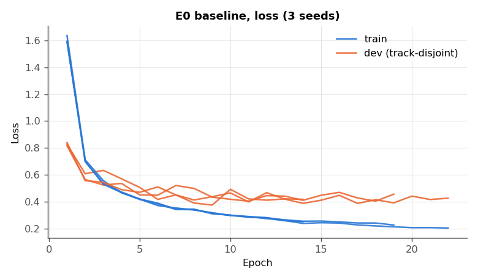

*Figure 7.1 — E0 training and dev loss per epoch, all three seeds.*

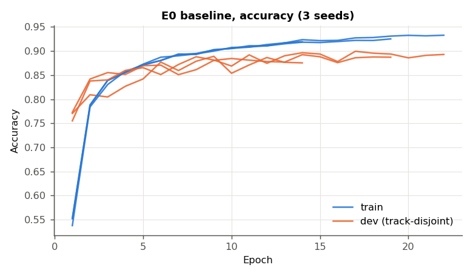

*Figure 7.2 — E0 training and dev accuracy per epoch, all three seeds. Training accuracy is the running accuracy with dropout active.*

### 7.2 Per-class performance

**Table 7.2 — E0 per-class test metrics (mean over 3 seeds)**

| Class | Name | Train images | Test images | Precision | Recall | F1 (± sd) |
|---|---|---|---|---|---|---|
| 0 | Speed limit 20 | 180 | 60 | 0.944 | 0.672 | 0.785 ± 0.058 |
| 1 | Speed limit 30 | 1980 | 720 | 0.854 | 0.894 | 0.874 ± 0.012 |
| 2 | Speed limit 50 | 2010 | 750 | 0.800 | 0.907 | 0.850 ± 0.016 |
| 3 | Speed limit 60 | 1260 | 450 | 0.890 | 0.867 | 0.878 ± 0.012 |
| 4 | Speed limit 70 | 1770 | 660 | 0.889 | 0.852 | 0.869 ± 0.019 |
| 5 | Speed limit 80 | 1650 | 630 | 0.780 | 0.781 | 0.775 ± 0.017 |
| 6 | End speed limit 80 | 360 | 150 | 0.869 | 0.653 | 0.744 ± 0.029 |
| 7 | Speed limit 100 | 1290 | 450 | 0.883 | 0.798 | 0.837 ± 0.027 |
| 8 | Speed limit 120 | 1260 | 450 | 0.838 | 0.810 | 0.816 ± 0.046 |
| 9 | No passing | 1320 | 480 | 0.960 | 0.986 | 0.973 ± 0.011 |
| 10 | No passing >3.5t | 1800 | 660 | 0.948 | 0.949 | 0.948 ± 0.018 |
| 11 | Right-of-way at intersection | 1170 | 420 | 0.929 | 0.933 | 0.931 ± 0.004 |
| 12 | Priority road | 1890 | 690 | 0.922 | 0.946 | 0.934 ± 0.005 |
| 13 | Yield | 1920 | 720 | 0.948 | 0.994 | 0.970 ± 0.003 |
| 14 | Stop | 690 | 270 | 0.960 | 0.970 | 0.965 ± 0.014 |
| 15 | No vehicles | 540 | 210 | 0.905 | 0.830 | 0.866 ± 0.009 |
| 16 | No vehicles >3.5t | 360 | 150 | 0.961 | 0.976 | 0.968 ± 0.011 |
| 17 | No entry | 990 | 360 | 0.983 | 0.951 | 0.967 ± 0.006 |
| 18 | General caution | 1080 | 390 | 0.810 | 0.784 | 0.795 ± 0.046 |
| 19 | Dangerous curve left | 180 | 60 | 0.840 | 0.561 | 0.642 ± 0.123 |
| 20 | Dangerous curve right | 300 | 90 | 0.694 | 0.667 | 0.673 ± 0.023 |
| 21 | Double curve | 270 | 90 | 0.549 | 0.689 | 0.608 ± 0.017 |
| 22 | Bumpy road | 330 | 120 | 0.881 | 0.811 | 0.843 ± 0.031 |
| 23 | Slippery road | 450 | 150 | 0.811 | 0.800 | 0.791 ± 0.023 |
| 24 | Road narrows on right | 240 | 90 | 0.825 | 0.737 | 0.779 ± 0.025 |
| 25 | Road work | 1350 | 480 | 0.931 | 0.893 | 0.911 ± 0.015 |
| 26 | Traffic signals | 540 | 180 | 0.685 | 0.713 | 0.695 ± 0.036 |
| 27 | Pedestrians | 210 | 60 | 0.565 | 0.450 | 0.497 ± 0.026 |
| 28 | Children crossing | 480 | 150 | 0.835 | 0.776 | 0.803 ± 0.013 |
| 29 | Bicycles crossing | 240 | 90 | 0.870 | 0.841 | 0.853 ± 0.016 |
| 30 | Beware of ice/snow | 390 | 150 | 0.657 | 0.584 | 0.614 ± 0.023 |
| 31 | Wild animals crossing | 690 | 270 | 0.719 | 0.811 | 0.760 ± 0.038 |
| 32 | End of all limits | 210 | 60 | 0.853 | 0.778 | 0.808 ± 0.060 |
| 33 | Turn right ahead | 599 | 210 | 0.977 | 0.922 | 0.947 ± 0.037 |
| 34 | Turn left ahead | 360 | 120 | 0.947 | 0.983 | 0.965 ± 0.018 |
| 35 | Ahead only | 1080 | 390 | 0.978 | 0.978 | 0.978 ± 0.003 |
| 36 | Go straight or right | 330 | 120 | 0.951 | 0.894 | 0.921 ± 0.014 |
| 37 | Go straight or left | 180 | 60 | 0.940 | 0.922 | 0.930 ± 0.013 |
| 38 | Keep right | 1860 | 690 | 0.972 | 0.956 | 0.964 ± 0.008 |
| 39 | Keep left | 270 | 90 | 0.889 | 0.956 | 0.917 ± 0.081 |
| 40 | Roundabout mandatory | 300 | 90 | 0.899 | 0.863 | 0.876 ± 0.014 |
| 41 | End of no passing | 210 | 60 | 0.833 | 0.633 | 0.708 ± 0.031 |
| 42 | End of no passing >3.5t | 210 | 90 | 0.813 | 0.915 | 0.858 ± 0.050 |
|  | **Macro average** |  | 12630 | **0.860** | **0.830** | **0.839** |

**Table 7.3 — Ten weakest classes by mean F1 (E0)**

| Rank | Class | Name | F1 | Train images | Test images |
|---|---|---|---|---|---|
| 1 | 27 | Pedestrians | 0.497 | 210 | 60 |
| 2 | 21 | Double curve | 0.608 | 270 | 90 |
| 3 | 30 | Beware of ice/snow | 0.614 | 390 | 150 |
| 4 | 19 | Dangerous curve left | 0.642 | 180 | 60 |
| 5 | 20 | Dangerous curve right | 0.673 | 300 | 90 |
| 6 | 26 | Traffic signals | 0.695 | 540 | 180 |
| 7 | 41 | End of no passing | 0.708 | 210 | 60 |
| 8 | 6 | End speed limit 80 | 0.744 | 360 | 150 |
| 9 | 31 | Wild animals crossing | 0.760 | 690 | 270 |
| 10 | 5 | Speed limit 80 | 0.775 | 1650 | 630 |

**Correlation between class size and F1:** Pearson r = 0.42, Spearman ρ = 0.44 over the 43 classes (training images per class against mean test F1). 7 of the ten weakest classes have fewer than 420 training images, but class size explains only about 18% of the variance in F1 (r² = 0.18). The weak classes are rare *and* look like another class, so class weighting on its own would not close the gap.

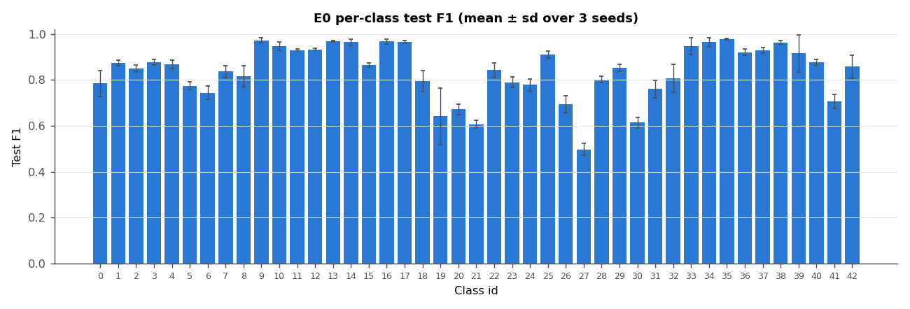

*Figure 7.3 — E0 per-class test F1, mean ± sd over 3 seeds.*

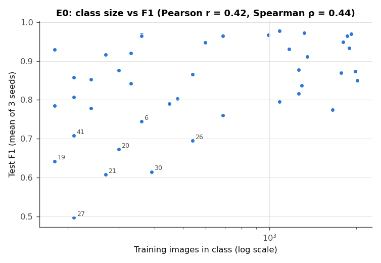

*Figure 7.4 — Training images per class against test F1 (log x-axis). The eight weakest classes are labelled.*

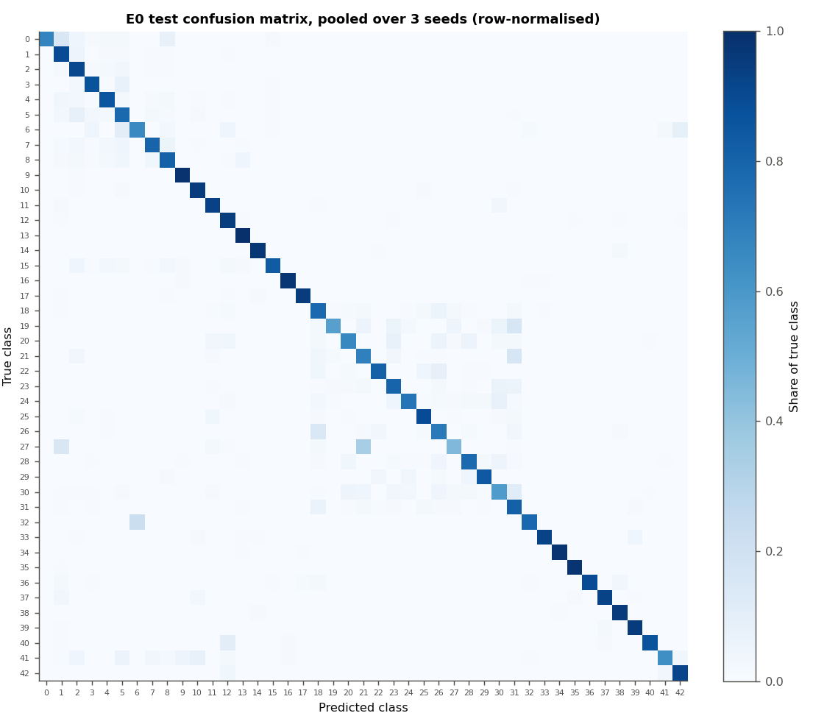

*Figure 7.5 — E0 test confusion matrix pooled over the three seeds, rows normalised by class size.*

### 7.3 Most frequent confusions and error slices

**Table 7.4 — Ten most frequent confused pairs (E0, counted over 3 seeds)**

| Errors (3 seeds) | Per seed | True class | Predicted class | Plausible cause |
|---|---|---|---|---|
| 150 | 50.0 | 5 Speed limit 80 | 2 Speed limit 50 | digits 8 and 5 |
| 106 | 35.3 | 1 Speed limit 30 | 2 Speed limit 50 | digits 3 and 5 |
| 102 | 34.0 | 3 Speed limit 60 | 5 Speed limit 80 | digits 6 and 8 are near-identical at 32×32 |
| 82 | 27.3 | 7 Speed limit 100 | 8 Speed limit 120 | 100 and 120 |
| 80 | 26.7 | 26 Traffic signals | 18 General caution | same red triangle; thin vertical pictograms |
| 75 | 25.0 | 2 Speed limit 50 | 5 Speed limit 80 | digits 5 and 8 |
| 75 | 25.0 | 4 Speed limit 70 | 1 Speed limit 30 | digits 7 and 3 |
| 69 | 23.0 | 18 General caution | 26 Traffic signals | same red triangle; thin vertical pictograms |
| 62 | 20.7 | 27 Pedestrians | 21 Double curve | same triangle; small pictogram |
| 59 | 19.7 | 7 Speed limit 100 | 5 Speed limit 80 | 100 and 80 |

Across the three seeds there are 4624 test errors, 1541 per seed on average. 2070 (45%) have a true class among the speed limits (classes 0–8), and 80% of those are predicted as another speed limit. 1627 (35%) are triangular warning signs (classes 18–31), and 82% of those stay within the triangles. The two families account for 80% of all errors. The blue circular mandatory signs (33–40) account for only 273.

**Table 7.5 — E0 test accuracy by original sign size and by image sharpness (mean ± sd over 3 seeds)**

| Slice | Images | Accuracy |
|---|---|---|
| Sign ROI 0–30 px (√(w·h)) | 5576 | 79.91% ± 0.81% |
| Sign ROI 30–40 px (√(w·h)) | 2714 | 93.48% ± 0.65% |
| Sign ROI 40–50 px (√(w·h)) | 1623 | 95.34% ± 0.14% |
| Sign ROI 50–70 px (√(w·h)) | 1621 | 96.11% ± 0.19% |
| Sign ROI 70–max px (√(w·h)) | 1096 | 90.36% ± 1.20% |
| Sharpness quartile 1 (blurriest) | 3158 | 79.32% ± 1.26% |
| Sharpness quartile 2 | 3157 | 89.55% ± 0.53% |
| Sharpness quartile 3 | 3157 | 88.91% ± 0.69% |
| Sharpness quartile 4 (sharpest) | 3158 | 93.40% ± 0.23% |

The median ROI side is 22 px for misclassified images and 33 px for correctly classified ones. Sharpness is the variance of the Laplacian of the preprocessed 32×32 image. It is a proxy measure: small signs are upsampled and so also come out blurrier, and the two slices are not independent.

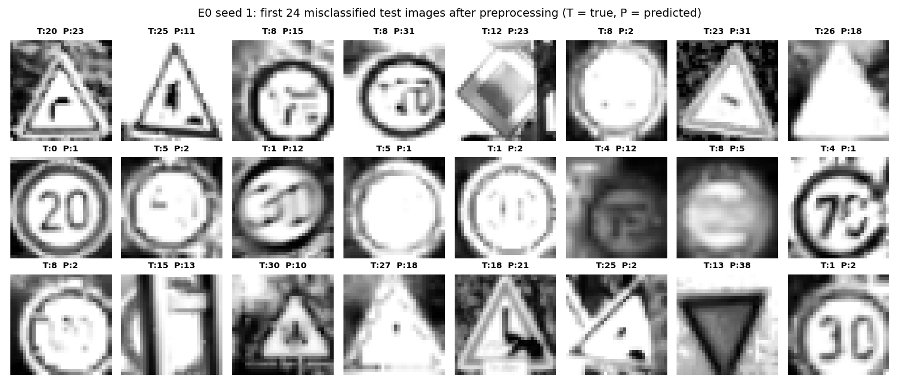

*Figure 7.6 — The first 24 misclassified test images for E0 seed 1, after preprocessing (T = true class, P = predicted).*

### 7.4 Ablation results

Each table changes one factor from E0. The McNemar column counts the seeds for which the run differs significantly from the E0 run of the same seed on the paired test predictions, and whether all differences go the same way. Welch p compares the three macro-F1 values with E0's. **Verdict** follows Section 6.6: better or worse only when all three seeds agree on McNemar and Welch p < 0.05. Seed-to-seed E0 comparisons are themselves McNemar-significant (Section 8.2), so a "mixed" pattern means no effect beyond seed noise. "Dev − test" is best dev accuracy minus test accuracy, a direct measure of how well the dev split predicts test performance.

**Table 7.6 — Initialisation (E1)**

| Condition | Macro-F1 | Test accuracy | Dev − test (pts) | Epochs run | McNemar: seeds p<0.05 | Welch p | Verdict |
|---|---|---|---|---|---|---|---|
| Baseline E0 (He, Adam, dropout 0.8, [512,256]) | 0.839 ± 0.007 | 87.80 ± 0.49% | 1.6 ± 0.5 | 18.3 ± 4.0 | — | — | reference |
| Random ×0.01 initialisation | 0.844 ± 0.012 | 87.80 ± 1.12% | 1.9 ± 0.5 | 27.7 ± 5.7 | 3/3, mixed | 0.56 | no consistent effect |

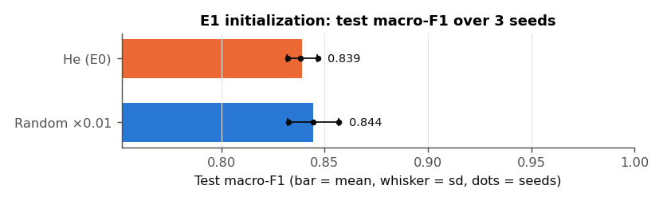

*Figure 7.7a — E1: test macro-F1 per condition (bar = mean, whisker = sd, dots = individual seeds).*

**Table 7.7 — Optimizer (E2)**

| Condition | Macro-F1 | Test accuracy | Dev − test (pts) | Epochs run | McNemar: seeds p<0.05 | Welch p | Verdict |
|---|---|---|---|---|---|---|---|
| Baseline E0 (He, Adam, dropout 0.8, [512,256]) | 0.839 ± 0.007 | 87.80 ± 0.49% | 1.6 ± 0.5 | 18.3 ± 4.0 | — | — | reference |
| Mini-batch GD, lr 0.001 | 0.520 ± 0.030 | 70.32 ± 0.52% | -1.4 ± 2.9 | 40.0 ± 0.0 | 3/3, worse | 0.0019 | **worse** |
| Mini-batch GD, lr 0.05 | 0.844 ± 0.014 | 87.87 ± 1.36% | 1.5 ± 1.0 | 24.7 ± 13.4 | 3/3, mixed | 0.64 | no consistent effect |
| Batch GD, lr 0.001 | 0.016 ± 0.004 | 5.66 ± 1.62% | -0.8 ± 0.5 | 40.0 ± 0.0 | 3/3, worse | 1.9e-07 | **worse** |

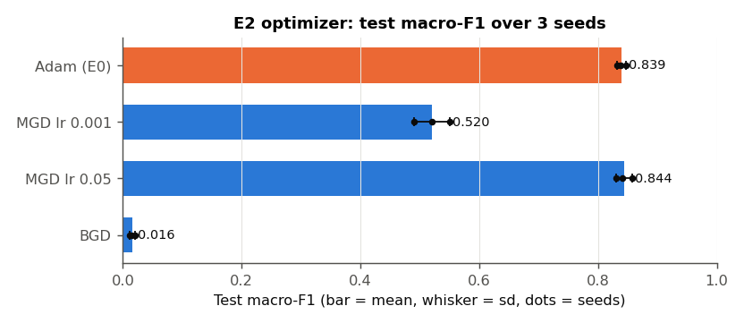

*Figure 7.7b — E2: test macro-F1 per condition (bar = mean, whisker = sd, dots = individual seeds).*

**Table 7.8 — Regularisation (E3)**

| Condition | Macro-F1 | Test accuracy | Dev − test (pts) | Epochs run | McNemar: seeds p<0.05 | Welch p | Verdict |
|---|---|---|---|---|---|---|---|
| Dropout p = 0.6 | 0.811 ± 0.035 | 86.20 ± 1.43% | 2.4 ± 0.4 | 20.0 ± 8.2 | 2/3, worse | 0.3 | no consistent effect |
| Dropout p = 0.7 | 0.841 ± 0.007 | 87.64 ± 0.97% | 2.1 ± 0.6 | 24.0 ± 7.9 | 2/3, mixed | 0.76 | no consistent effect |
| Baseline E0 (He, Adam, dropout 0.8, [512,256]) | 0.839 ± 0.007 | 87.80 ± 0.49% | 1.6 ± 0.5 | 18.3 ± 4.0 | — | — | reference |
| Dropout p = 0.9 | 0.824 ± 0.017 | 86.23 ± 1.89% | 2.1 ± 1.2 | 15.0 ± 7.8 | 2/3, mixed | 0.26 | no consistent effect |
| L2 λ = 1 | 0.806 ± 0.010 | 84.92 ± 0.62% | 1.9 ± 0.5 | 10.7 ± 1.2 | 3/3, worse | 0.012 | **worse** |
| L2 λ = 3 | 0.823 ± 0.023 | 85.84 ± 1.64% | 1.3 ± 1.2 | 16.7 ± 4.0 | 2/3, worse | 0.35 | no consistent effect |
| L2 λ = 10 | 0.813 ± 0.023 | 85.34 ± 2.00% | 1.8 ± 1.4 | 17.3 ± 8.4 | 3/3, worse | 0.18 | worse (McNemar only) |
| L2 λ = 30 | 0.822 ± 0.010 | 85.99 ± 1.35% | 1.8 ± 0.3 | 18.3 ± 6.5 | 3/3, worse | 0.073 | worse (McNemar only) |
| No regularisation | 0.811 ± 0.009 | 85.42 ± 0.70% | 1.8 ± 0.9 | 14.7 ± 4.0 | 3/3, worse | 0.014 | **worse** |

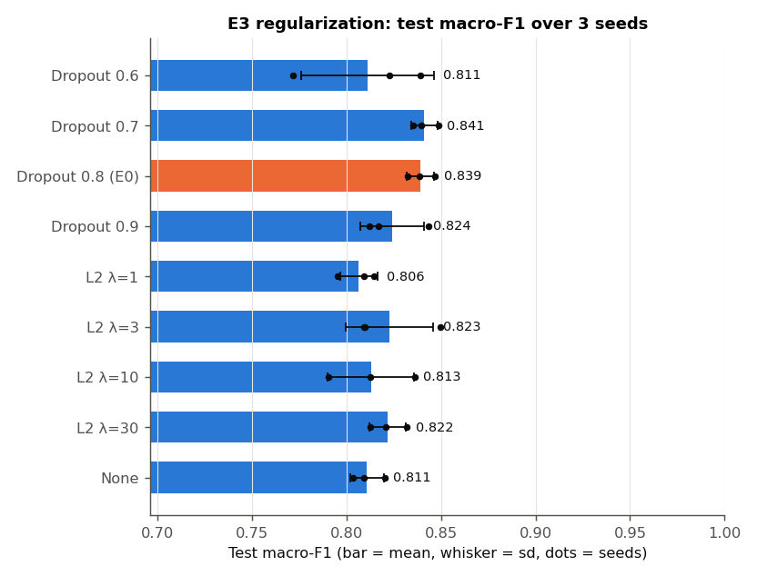

*Figure 7.7c — E3: test macro-F1 per condition (bar = mean, whisker = sd, dots = individual seeds).*

**Table 7.9 — Architecture (E4)**

| Condition | Macro-F1 | Test accuracy | Dev − test (pts) | Epochs run | McNemar: seeds p<0.05 | Welch p | Verdict |
|---|---|---|---|---|---|---|---|
| [256] | 0.833 ± 0.010 | 86.96 ± 0.63% | 1.5 ± 0.5 | 20.7 ± 0.6 | 2/3, worse | 0.44 | no consistent effect |
| Baseline E0 (He, Adam, dropout 0.8, [512,256]) | 0.839 ± 0.007 | 87.80 ± 0.49% | 1.6 ± 0.5 | 18.3 ± 4.0 | — | — | reference |
| [1024, 512, 256] | 0.839 ± 0.006 | 87.82 ± 0.39% | 1.9 ± 0.4 | 22.0 ± 4.6 | 0/3, mixed | 0.92 | no consistent effect |
| [1024, 512, 256, 128] | 0.819 ± 0.031 | 86.14 ± 1.71% | 1.8 ± 0.6 | 15.3 ± 6.0 | 2/3, worse | 0.38 | no consistent effect |

Parameters: [256] 273,451, E0 667,179, [1024, 512, 256] 1,716,779, [1024, 512, 256, 128] 1,744,171. Mean training time (indicative, see above): [256] 43 ± 1 s, E0 96 ± 32 s, [1024, 512, 256] 318 ± 73 s, [1024, 512, 256, 128] 223 ± 98 s.

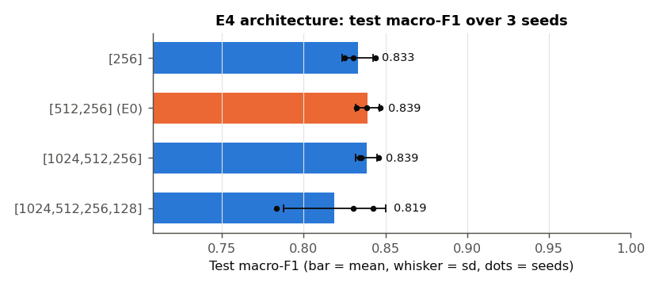

*Figure 7.7d — E4: test macro-F1 per condition (bar = mean, whisker = sd, dots = individual seeds).*

**Table 7.10 — Augmentation (E5)**

| Condition | Macro-F1 | Test accuracy | Dev − test (pts) | Epochs run | McNemar: seeds p<0.05 | Welch p | Verdict |
|---|---|---|---|---|---|---|---|
| Baseline E0 (He, Adam, dropout 0.8, [512,256]) | 0.839 ± 0.007 | 87.80 ± 0.49% | 1.6 ± 0.5 | 18.3 ± 4.0 | — | — | reference |
| + 5 augmented variants per image | 0.874 ± 0.003 | 90.88 ± 0.11% | 2.1 ± 0.1 | 26.3 ± 2.1 | 3/3, better | 0.0062 | **better** |

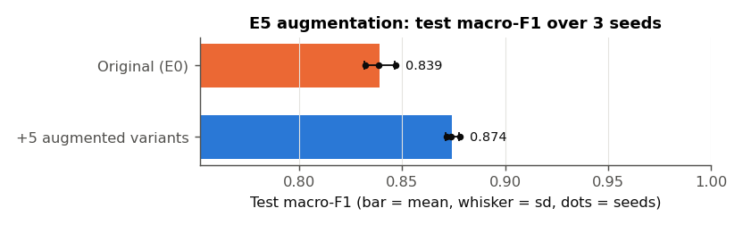

*Figure 7.7e — E5: test macro-F1 per condition (bar = mean, whisker = sd, dots = individual seeds).*

**Table 7.11 — Learning-rate decay (E6)**

| Condition | Macro-F1 | Test accuracy | Dev − test (pts) | Epochs run | McNemar: seeds p<0.05 | Welch p | Verdict |
|---|---|---|---|---|---|---|---|
| Baseline E0 (He, Adam, dropout 0.8, [512,256]) | 0.839 ± 0.007 | 87.80 ± 0.49% | 1.6 ± 0.5 | 18.3 ± 4.0 | — | — | reference |
| Step decay, halve every 10 epochs | 0.866 ± 0.009 | 89.68 ± 0.67% | 1.5 ± 0.5 | 29.3 ± 10.5 | 3/3, better | 0.017 | **better** |

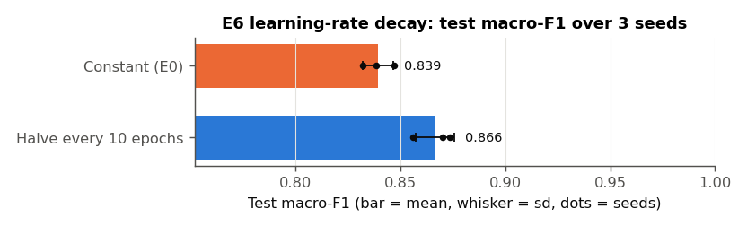

*Figure 7.7f — E6: test macro-F1 per condition (bar = mean, whisker = sd, dots = individual seeds).*

E5 trains on six times as many images per epoch as the baseline (seed 1: 34,799 + 173,995 augmented = 208,794). With the final code a run took 420 ± 37 s (one job, two threads), and peak memory was 3.4 GB. The original float64 code was OOM-killed at 5.8 GB (Appendix D).

### 7.5 Calibration and rejection

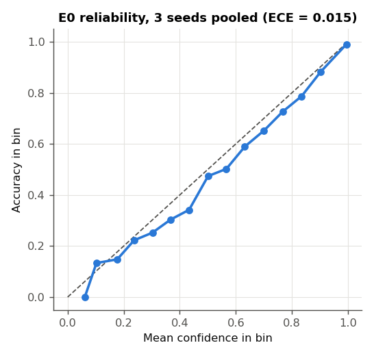

*Figure 7.8 — E0 reliability diagram, 3 seeds pooled (15 equal-width confidence bins).*

**Table 7.12 — Rejecting low-confidence predictions (E0, 3 seeds pooled)**

| Confidence threshold | Images accepted | Accuracy on accepted | Errors rejected | Correct predictions rejected |
|---|---|---|---|---|
| 0.500 | 91.5% | 93.14% | 48.6% | 2.9% |
| 0.700 | 84.3% | 96.33% | 74.6% | 7.5% |
| 0.800 | 80.6% | 97.55% | 83.8% | 10.5% |
| 0.900 | 75.1% | 98.74% | 92.3% | 15.5% |

### 7.6 Computational efficiency

**Table 7.13 — Training speed before and after the Phase 2 optimisations (same machine, one job, E0 configuration)**

| Code version | Seconds per epoch | Peak RSS | Model file |
|---|---|---|---|
| Original (float64, extra forward pass, allocating Adam) | 6.25 s | 1112 MB | 5.1 MB |
| Final (float32, fused metrics, in-place Adam) | 2.61 s | 645 MB | 2.5 MB |
| **Speed-up / saving** | **2.4×** | 42% | 50% |

The epoch time excludes data loading. It is (wall time of a 6-epoch run − wall time of a 1-epoch run) / 5 for the E0 configuration with early stopping disabled. Both versions were run one after the other on the idle machine. It measures early epochs. In the Phase 2 logs, the runs trained before the subnormal flush slowed down as training progressed. E0 averaged 8.8 ms/step over its first three epochs and 18.8 over its last three, and L2 with λ = 30 went from 11 to 159. The runs without Adam (MGD) did not slow down, and neither did E5, trained with the flush (8.3 → 9.4). The flush leaves training bit-identical: E0 seed 1 retrained with it has exactly the same parameters (maximum absolute difference 0) and dev-accuracy history as the run without it (`results/ftz_equivalence.json`).

**Inference.** For the E0 model (667,179 parameters, float32), a batched forward pass over the 12,630 test images takes a median of 0.10 s over 7 repeats, or 7.9 µs per image. Classifying one image at a time takes a median of 58 µs (95th percentile 112 µs, 1,000 images), because per-call overhead dominates a network this small. Both figures cover the forward pass on preprocessed input only; image decoding and preprocessing are excluded.

### 7.7 Effect of the protocol and code fixes (Phase 1 → Phase 2)

**Table 7.14 — E0 baseline under the original and the final protocol**

| Quantity | Phase 1 (original code, random dev split, 1 seed) | Phase 2 (final code, track split, 3 seeds) |
|---|---|---|
| Test accuracy | 88.46% | 87.80 ± 0.49% |
| Macro-F1 | 0.841 | 0.839 ± 0.007 |
| Best dev accuracy | 95.08% | 89.37 ± 0.53% |
| Dev − test (points) | 6.6 | 1.6 ± 0.5 |
| Epochs run | 28 | 18.3 ± 4.0 |
| Training time | 170 s (1 job, 2 threads) | 96 ± 32 s (2 parallel jobs, 1 thread each) |

Over all configurations that trained properly (excluding the two non-converging optimizers), the mean dev − test gap was 6.0 points in Phase 1 (range 4.2–7.8) and 1.8 points in Phase 2 (range 1.3–2.4).


---

## 8. Discussion

### 8.1 Baseline interpretation

The baseline reaches 87.80 ± 0.49% test accuracy and 0.839 ± 0.007 macro-F1. The 4-point gap between the two is the per-class spread hidden by accuracy: 8 classes score F1 above 0.95 (for example Ahead only, No passing, Yield, No vehicles >3.5t), and the ten weakest classes score between 0.50 and 0.77 (Table 7.3). Macro-F1 is the headline metric for exactly this reason.

**The dev set now predicts the test set.** With the track-disjoint split, best dev accuracy exceeds test accuracy by 1.6 ± 0.5 points. On the random split of Phase 1 the gap was 6.6 points (Table 7.14). The remaining gap is what one expects from selecting the best epoch on the dev set. It confirms that the Phase 1 dev figures measured recognition of near-duplicate frames, not generalisation to new physical signs.

**Fit and stopping.** At the restored epoch the train–dev gap is 2.2 ± 0.9 points. The network fits the training frames much better than new tracks, so the main limit is generalisation, not optimisation. Early stopping restored epoch 13.3 ± 4.0 on average and ended the runs after 18.3 ± 4.0 of the 40 epochs, so the epoch budget was not binding for Adam. The track-disjoint dev accuracy is noisier than the random one: whole tracks enter or leave it together. With a patience of 5, some runs may stop early. The learning-rate schedule result in Section 8.2 is consistent with that.

**Calibration.** The model is well calibrated (ECE 0.016 ± 0.006). Mean confidence is 0.942 when it is right and 0.540 when it is wrong. That makes the confidence usable as a rejection signal: rejecting predictions below 0.7 would catch 75% of the errors, cost 7.5% of the correct predictions, and raise accuracy on the accepted 84% of images to 96.3% (Table 7.12). For a safety-relevant perception component, a model that knows when it does not know is worth as much as a point of accuracy.

### 8.2 Ablation interpretation

**How to read the tests.** Paired McNemar tests on 12,630 test images are very sensitive. Two E0 runs that differ only in their seed already disagree on 814–912 test images, and McNemar calls the difference significant for most seed pairs (discordant images and p per pair: 814 (p = 4e-05), 912 (p = 0.002), 846 (p = 0.4)). A single-seed McNemar result therefore mostly measures run-to-run variation, not the effect of the configuration. An effect is claimed here only when all three seeds move in the same direction with p < 0.05 *and* Welch's test on the three macro-F1 values agrees. With three seeds that second test is strict, so a "no consistent effect" verdict means "not demonstrated", not "shown to be zero".

**E1 — initialisation.** Random ×0.01 initialisation reached the same macro-F1 as He (0.844 ± 0.012 against 0.839 ± 0.007; no consistent effect). It needed more epochs, 27.7 ± 5.7 against 18.3 ± 4.0, because the tiny initial weights start the forward signal close to zero. Adam's per-parameter step sizes compensate quickly in a network of this depth. He initialisation buys convergence speed, not final accuracy.

**E2 — optimizer.** At Adam's learning rate of 0.001, plain mini-batch gradient descent is far behind (0.520 ± 0.030 macro-F1). It was still improving when the 40-epoch budget ran out in every seed. With its own learning rate of 0.05, however, it matches Adam (0.844 ± 0.014; no consistent effect) and stops earlier (24.7 ± 13.4 epochs). Adam's practical advantage here is robustness to the learning-rate choice, not a better optimum. Batch gradient descent fails outright (5.66 ± 1.62% accuracy): one update per epoch gives it 40 gradient steps in total against about 5,000 for the baseline, so under an epoch budget it is starved of updates, not of gradient quality. It also has the largest memory footprint (1.5 GB), because it propagates all training images at once.

**E3 — regularisation.** Dropout at p = 0.7–0.8 is the best regulariser tested (0.841 ± 0.007 and 0.839 ± 0.007). Moving away in either direction lowers the mean and widens the seed-to-seed spread: p = 0.6 gives 0.811 ± 0.035 and p = 0.9 gives 0.824 ± 0.017. Neither change is a consistent effect. Removing regularisation altogether costs 2.8 points of macro-F1 (significantly worse). With the normalisation fixed, L2 no longer under-fits catastrophically as in Phase 1, but no strength beats dropout: λ = 1–30 gives 0.806–0.823, which is about the same as no regularisation. Two mechanisms plausibly explain the weak L2 result. First, with Adam an L2 term in the gradient is rescaled per parameter by the adaptive denominator, so it does not act as uniform weight decay [15]. Second, early stopping already provides a similar implicit shrinkage. Dropout's model-averaging effect is what this over-parameterised network (about 19 parameters per training image) benefits from.

**E4 — depth and width.** Capacity does not help. [256] (0.833 ± 0.010), [512, 256] (0.839 ± 0.007) and [1024, 512, 256] (0.839 ± 0.006) are indistinguishable, and the four-hidden-layer network is lower on average and much less stable across seeds (0.819 ± 0.031; not a consistent effect). The 1.7 million-parameter network costs roughly three times the training time per run for no gain. This is the architectural ceiling of Section 8.4 seen from the other side: more fully connected units add capacity, but not the translation invariance or locality that the errors in Section 8.3 call for.

**E5 — augmentation.** Adding five augmented variants per image raises macro-F1 from 0.839 ± 0.007 to 0.874 ± 0.003 and accuracy from 87.80 ± 0.49% to 90.88 ± 0.11% (significantly better). The mean per-class F1 change is +0.039 for the 19 rare classes (< 420 training images) and +0.032 for the rest: slightly larger for the rare classes, in the direction predicted, though that difference was not tested. Shift, rotation, zoom and crop-and-pad show the network the positional variation it cannot infer by itself (Section 8.4). This is the most direct compensation for the missing translation invariance available within the architecture. The cost is six times as many images per epoch (420 ± 37 s per run with the final code) and 3.4 GB of memory.

**E6 — learning-rate decay.** Halving the learning rate every 10 epochs raises macro-F1 by 2.7 points to 0.866 ± 0.009 and accuracy to 89.68 ± 0.67% (significantly better). In Phase 1 the same experiment showed nothing, because the original schedule barely changed the rate (Appendix D). The decayed runs also train longer on average before early stopping (29.3 ± 10.5 epochs against 18.3 ± 4.0). The smaller steps reduce the epoch-to-epoch noise in dev accuracy that otherwise triggers early stopping prematurely (Section 8.1).

**What was not tested.** Each factor was varied one at a time from the baseline. Combinations, for example decay together with augmentation, were not run, and interactions are unknown. Each condition used the baseline learning rate except the second MGD run, so a factor whose best learning rate differs from 0.001 is judged conservatively.

### 8.3 Error analysis

The errors are concentrated where Section 7.3 predicted. The speed limits and the triangular warning signs account for 80% of test errors, and about four in five of those errors stay inside their family. The network recognises the family (the red ring, the red triangle) and misreads the interior. Among the speed limits the dominant confusions are digit pairs: 80 → 50, 30 → 50, 60 → 80, 100 → 120 and 70 → 30 (Table 7.4). At 32×32 grayscale these digits differ in a handful of pixels, and a fully connected layer has no local detector to isolate them. Among the triangles, General caution and Traffic signals are confused in both directions: both are a thin vertical pictogram in a red triangle. In colour the traffic-signal lamps would separate them at once (Section 9.1).

**Image properties.** Size is the strongest predictor of failure. Signs whose ROI is under 30 px across make up 44% of the test set and are classified at 79.9%, against 93.5%–96.1% for 30–70 px signs. The median misclassified sign is 22 px against 33 px for correct ones. Small signs are upsampled to 32×32 and blurred in the process, and the blurriest quartile scores 79.3% against 93.4% for the sharpest. Very large signs (> 70 px) drop again to 90.4%. These are close-range frames, probably with stronger perspective distortion and a partially cropped sign, though this was not measured. Figure 7.6 shows the typical visual failure modes: interiors washed out by histogram equalisation until the digits almost vanish, heavy blur, and off-centre crops.

**Top-2.** Top-2 accuracy is 92.55 ± 0.32% against 87.80 ± 0.49% for top-1, so the right answer is the runner-up for roughly 39% of the errors. The largest top-2 gains are in the confusable classes: End of all limits (78% → 100%), Double curve (69% → 87%), Traffic signals (71% → 85%), Dangerous curve left (56% → 68%). For these the network has narrowed the choice to two look-alikes and ranks them the wrong way round. The discriminating detail is present but weakly encoded, which points to input resolution and colour, not more units, as the lever.


### 8.4 The architectural ceiling

The dominant limitation is structural, and worth stating precisely because it
is the whole reason this architecture underperforms the state of the art.

**No translation invariance.** A fully connected layer assigns an independent
weight to each input coordinate. Input pixel 100 and input pixel 101 are, to
the network, unrelated variables — the fact that they are horizontally adjacent
is information the architecture cannot represent. A sign shifted three pixels
right is a substantially different input vector, and the network must learn its
appearance separately at every position it can occupy. Convolutional networks
solve this by weight sharing: one learned filter is applied at every position,
so a feature learned at one location transfers to all others for free.

**No spatial locality.** Every hidden unit in layer 1 sees all 1,024 inputs at
once. There is no architectural pressure towards local features — edges,
corners, strokes — that compose into larger structures. The hierarchical
composition that makes CNNs sample-efficient on images is unavailable.

**The consequence is sample efficiency, not capacity.** By the universal
approximation theorem [5], the network *could* represent a good classifier. It
would need vastly more data to *find* one, because it must learn from examples
what a convolutional architecture is given by construction. Section 2.1 shows
the empirical size of the gap: 99.46% for a CNN committee against 95.68% for
classical LDA on HOG features, with an MLP on raw pixels expected below the
latter.

This is a well-understood limitation and the reason the field moved to
convolutional architectures for vision. Documenting it precisely is more useful
than obscuring it.

---

## 9. Limitations and threats to validity

### 9.1 Grayscale conversion discards regulatory colour

German traffic signs encode meaning in colour by regulation: red borders for
prohibitory, blue for mandatory, yellow for temporary. Grayscale conversion
discards this. The trade-off was taken to keep the input dimension at 1,024
(Section 4.2), and Sermanet and LeCun [3] report the cost on GTSRB is modest —
but it is a cost, and it is likely concentrated exactly where colour is the
main discriminant between otherwise similar shapes.

### 9.2 Recognition, not detection

The system classifies images that already contain one cropped, centred sign,
using ROI annotations supplied by the benchmark. A deployed system must first
*find* signs in a full scene. This is a distinct problem requiring a detector,
and no part of it is addressed here. Reported accuracy therefore describes only
the classification stage of a hypothetical pipeline.

### 9.3 Dev split and early stopping

The original random 90/10 split put frames of the same physical sign on both sides. Phase 1 measured the consequence: dev accuracy overstated test accuracy by 4–8 points (Appendix D). The final protocol holds out whole tracks, and the gap falls to 1.6 ± 0.5 points (Section 7.7). The remaining threats are milder. A track-disjoint dev set of about 4,400 frames contains only about 147 physical signs, so dev accuracy is noisy, and a patience of 5 epochs can stop training early (Section 8.1). Model selection uses the dev set only. The test set was used once per trained model, and no configuration was chosen on test performance.


### 9.4 Class imbalance is uncorrected

No class weighting, oversampling or loss reweighting is applied. The 10.7:1
imbalance is passed through to training as-is. This is why macro-F1 rather than
accuracy is the headline metric — the metric reveals the problem rather than
solving it.

### 9.5 Three seeds and many comparisons

Every configuration was run with three seeds. That is enough to show that seed-to-seed variation is large, often ±1–3 points of macro-F1 (Table 7.8), but gives Welch's test little power. The 17 comparisons against the baseline are not corrected for multiplicity. The effects reported as significant are the gains from step decay (E6) and augmentation (E5), and the losses from removing dropout, from L2 at λ = 1, and from plain gradient descent at lr 0.001 or in full batch. Each is consistent across all seeds, with McNemar p-values far below 0.05. Smaller differences, including every E1, E4 and dropout-rate comparison, should be read as "not demonstrated". More seeds would narrow this.


### 9.6 Fixed preprocessing is not ablated

The five preprocessing steps are held constant across all experiments and
justified by argument rather than measurement. The contribution of histogram
equalization in particular — argued in Section 4.2 to be the highest-value step
— is untested. An ablation over preprocessing would strengthen this.

### 9.7 Occlusion and physical degradation unaddressed

Neither the preprocessing nor the augmentation models partial occlusion,
fading, or vandalism, all of which occur in the test set. No augmentation
transformation simulates them, and performance on affected images is
uncharacterised.

### 9.8 Inference latency measured for the forward pass only

Forward-pass latency is measured (Section 7.6): 7.9 µs per image in a batch and 58 µs one image at a time on two CPU cores. Decoding, the ROI crop and the preprocessing of Section 4.2 are excluded. In a deployed system the sign would first have to be detected (Section 9.2), and that detector would dominate end-to-end latency.


---

## 10. Conclusion and future work

### 10.1 Conclusion

This report presented a traffic sign classifier for GTSRB built on a
feed-forward neural network implemented entirely from first principles in
NumPy. Forward propagation, backpropagation, Adam, inverted dropout, L2
regularization, He initialization and early stopping were each derived and
implemented directly, with no machine learning framework.

The methodological contributions stand independently of the training results.
A preprocessing pipeline was designed with each stage justified against a
specific property of the data. Augmentation transformations inherited from the
digit domain were re-examined and found partly invalid, with horizontal
mirroring identified as label-corrupting for eight directional sign classes.
Ten implementation defects were found and corrected, several of them silent
(Section 4.10). A controlled protocol of six ablations was run with three seeds
and paired significance tests, and the resource profile of training and
inference was measured.

On the GTSRB test set the baseline network reaches 87.80 ± 0.49% accuracy and 0.839 ± 0.007 macro-F1 (three seeds). The best configuration, training with augmentation (E5), reaches 90.88 ± 0.11% and 0.874 ± 0.003. This is well below the reference points in Section 2.1: 5–8 points below LDA on HOG features (95.68%) and 9–12 below the winning CNN committee (99.46%). That is the position the architectural analysis predicted. The error structure matches the prediction of Section 8.4. Errors concentrate inside sign families that differ only in a small interior pictogram, and on small, low-resolution images. Extra fully connected capacity does not help (E4).

Of the ablations, the learning-rate schedule (E6) and data augmentation (E5) produced consistent improvements. Removing regularisation, or replacing dropout with L2 at λ = 1, made the model significantly worse. The other L2 strengths were worse on McNemar only. Initialisation, width and depth, and moderate changes of the dropout rate made no consistent difference. Plain gradient descent matched Adam once its learning rate was tuned. The process produced two methodological lessons. First, a validation split that leaks near-duplicate frames overstated accuracy by 4–8 points, and fixing it made the dev set a reliable guide to test performance. Second, small implementation details can silently invalidate an ablation. In Phase 1 a learning-rate schedule that barely changed the rate made decay look useless; corrected, it is one of the two effective interventions. A mis-scaled L2 penalty made every λ under-fit; corrected, L2 behaves sensibly but still does not beat dropout. The same pass made training 2.4× faster through float32 arithmetic, in-place updates and flushing of subnormal values.


### 10.2 Future work

**Immediate, within this architecture**

1. **Combine the two effective interventions**: step decay plus augmentation, which were only tested separately.
2. **Class-imbalance correction**, via a weighted loss or targeted oversampling, with macro-F1 as the measure of success.
3. **Colour and resolution**: RGB input at 3,072 features, or 48×48 grayscale, targeted at the confusable pairs in Table 7.4.
4. **Preprocessing ablation**, in particular quantifying histogram equalisation, which Figure 7.6 suggests can also wash out digits.
5. **More seeds and a longer patience** (or a patience measured on a smoothed dev curve), to separate the small effects that three seeds cannot resolve.
6. **Decoupled weight decay** [15] instead of L2-in-the-gradient, to test whether explicit shrinkage helps once it is decoupled from Adam's scaling.
7. **End-to-end latency benchmark**, from camera frame to label (Section 9.8).


**Architectural**

8. **Convolutional layers.** The principled fix for both deficits in Section
   8.4. `src/dataset.py` feeds a CNN unchanged — omit `flatten_input`. This is
   the single highest-value change available.
9. **Batch normalisation**, to stabilise training in deeper configurations.
10. **Ensembling**, following the approach that won the original benchmark [2].

**Beyond classification**

11. **Detection**, converting recognition into a system usable on street scenes.
12. **Temporal aggregation** over the 30-frame tracks, since a deployed system
    sees a sequence and can accumulate evidence rather than deciding per frame.

---

## References

[1] J. Stallkamp, M. Schlipsing, J. Salmen, and C. Igel, "Man vs. computer:
Benchmarking machine learning algorithms for traffic sign recognition,"
*Neural Networks*, vol. 32, pp. 323–332, 2012.

[2] D. Cireşan, U. Meier, J. Masci, and J. Schmidhuber, "Multi-column deep
neural network for traffic sign classification," *Neural Networks*, vol. 32,
pp. 333–338, 2012.

[3] P. Sermanet and Y. LeCun, "Traffic sign recognition with multi-scale
convolutional networks," in *Proc. IJCNN*, 2011, pp. 2809–2813.

[4] N. Dalal and B. Triggs, "Histograms of oriented gradients for human
detection," in *Proc. CVPR*, 2005, pp. 886–893.

[5] K. Hornik, M. Stinchcombe, and H. White, "Multilayer feedforward networks
are universal approximators," *Neural Networks*, vol. 2, no. 5, pp. 359–366,
1989.

[6] Y. LeCun, L. Bottou, Y. Bengio, and P. Haffner, "Gradient-based learning
applied to document recognition," *Proc. IEEE*, vol. 86, no. 11, pp.
2278–2324, 1998.

[7] K. He, X. Zhang, S. Ren, and J. Sun, "Delving deep into rectifiers:
Surpassing human-level performance on ImageNet classification," in *Proc.
ICCV*, 2015, pp. 1026–1034.

[8] D. P. Kingma and J. Ba, "Adam: A method for stochastic optimization," in
*Proc. ICLR*, 2015.

[9] N. Srivastava, G. Hinton, A. Krizhevsky, I. Sutskever, and R.
Salakhutdinov, "Dropout: A simple way to prevent neural networks from
overfitting," *JMLR*, vol. 15, no. 1, pp. 1929–1958, 2014.

[10] I. Goodfellow, Y. Bengio, and A. Courville, *Deep Learning*. MIT Press,
2016.

[11] Q. McNemar, "Note on the sampling error of the difference between
correlated proportions or percentages," *Psychometrika*, vol. 12, no. 2, pp.
153–157, 1947.

[12] T. G. Dietterich, "Approximate statistical tests for comparing supervised
classification learning algorithms," *Neural Computation*, vol. 10, no. 7, pp.
1895–1923, 1998.

[13] B. L. Welch, "The generalization of 'Student's' problem when several
different population variances are involved," *Biometrika*, vol. 34, no. 1–2,
pp. 28–35, 1947.

[14] C. Guo, G. Pleiss, Y. Sun, and K. Q. Weinberger, "On calibration of modern
neural networks," in *Proc. ICML*, 2017, pp. 1321–1330.

[15] I. Loshchilov and F. Hutter, "Decoupled weight decay regularization," in
*Proc. ICLR*, 2019.

**Dataset citation.** J. Stallkamp, M. Schlipsing, J. Salmen, and C. Igel,
"The German Traffic Sign Recognition Benchmark: A multi-class classification
competition," in *Proc. IJCNN*, 2011, pp. 1453–1460. Available:
<https://benchmark.ini.rub.de/gtsrb_dataset.html>. Licensed CC BY 4.0.

---

## Appendix A — Reproducibility

**Environment.** `Dockerfile` and `docker-compose.yml` pin the complete
environment. See `SETUP.md` for both the container and native paths.

**Reproducing the baseline from a clean checkout:**

```bash
docker build -t traffic-sign-detection .
docker compose run --rm tsd python train.py --epochs 40 --out models/e0_baseline
docker compose run --rm tsd python evaluate.py --model models/e0_baseline --no-plot
```

**Seeding.** `np.random.seed(1)` at entry to every script; `--seed` overrides.
Given identical data and flags, runs reproduce.

**Data provenance.** GTSRB is downloaded from the URLs in `GTSRB_URLS`
(`src/dataset.py`), which are the archives linked from the official benchmark
page. Decoded arrays are cached as `dataset/gtsrb/gtsrb_32.npz`.

**Experiments reported in Section 7.** Run `experiments/run_all.sh` to train and evaluate every configuration × seed; runs that are already done are skipped. Two copies can run in parallel. Then run `python experiments/analyze.py`, `python experiments/error_analysis.py`, `python experiments/inference_timing.py` and `experiments/speed_benchmark.sh`. The unit tests are run with `python -m unittest discover -s tests`. The Phase 1 scripts and results are archived in `experiments/phase1/` and `results/phase1_original_code/`. The preprocessed dataset cache (`dataset/gtsrb/gtsrb_32.npz`, with track ids) is rebuilt automatically from the three official archives.

**Code manifest**

| File | Role |
|---|---|
| `src/dataset.py` | Acquisition, decoding, preprocessing, splitting, encoding |
| `src/ffnn.py` | Network: initialization, forward, cost, backward, optimizers, training, prediction |
| `src/model_utils.py` | Activations, mini-batching, metrics, confusion matrix, plots, persistence |
| `src/data_augmentation.py` | Augmentation transformations and generator |
| `train.py` / `evaluate.py` / `predict.py` / `augment.py` / `gui.py` | Entry points |
| `Project_Walkthrough.ipynb` | Step-by-step executable walkthrough |
| `tests/test_core.py` | Unit tests incl. numerical gradient check |
| `experiments/` | Experiment runner, analysis, significance tests, timing (Phase 2); `experiments/phase1/` archived Phase 1 scripts |
| `results/` | Logs, metrics, predictions and figures (Phase 2); `results/phase1_original_code/` |
| `CLAUDE.md`, `docs/` | Repository map, architecture and data-flow diagrams |
| `README.md` / `SETUP.md` | Overview and setup guide |

---

## Appendix B — Class index

| id | Class | id | Class | id | Class |
|---|---|---|---|---|---|
| 0 | Speed limit 20 | 15 | No vehicles | 30 | Beware of ice/snow |
| 1 | Speed limit 30 | 16 | No vehicles >3.5t | 31 | Wild animals crossing |
| 2 | Speed limit 50 | 17 | No entry | 32 | End of all limits |
| 3 | Speed limit 60 | 18 | General caution | 33 | Turn right ahead |
| 4 | Speed limit 70 | 19 | Dangerous curve left | 34 | Turn left ahead |
| 5 | Speed limit 80 | 20 | Dangerous curve right | 35 | Ahead only |
| 6 | End speed limit 80 | 21 | Double curve | 36 | Go straight or right |
| 7 | Speed limit 100 | 22 | Bumpy road | 37 | Go straight or left |
| 8 | Speed limit 120 | 23 | Slippery road | 38 | Keep right |
| 9 | No passing | 24 | Road narrows on right | 39 | Keep left |
| 10 | No passing >3.5t | 25 | Road work | 40 | Roundabout mandatory |
| 11 | Right-of-way at intersection | 26 | Traffic signals | 41 | End of no passing |
| 12 | Priority road | 27 | Pedestrians | 42 | End of no passing >3.5t |
| 13 | Yield | 28 | Children crossing | | |
| 14 | Stop | 29 | Bicycles crossing | | |

The eight directional classes affected by the mirroring analysis in Section 4.10
are 19, 20, 33, 34, 36, 37, 38 and 39.

---

## Appendix C — Notation

| Symbol | Meaning |
|---|---|
| $m$ | Number of examples in the current batch |
| $L$ | Number of layers (hidden + output) |
| $n^{[l]}$ | Units in layer $l$; $n^{[0]} = 1024$, $n^{[L]} = 43$ |
| $X$ | Input matrix, $(1024 \times m)$ |
| $Y$ | One-hot labels, $(43 \times m)$ |
| $\hat{Y}$ | Predicted probabilities, $(43 \times m)$ |
| $W^{[l]}, b^{[l]}$ | Weights and biases of layer $l$ |
| $Z^{[l]}, A^{[l]}$ | Pre-activation and activation of layer $l$ |
| $D^{[l]}$ | Dropout mask for layer $l$ |
| $\alpha, \lambda, p$ | Learning rate, L2 strength, dropout keep probability |
| $\beta_1, \beta_2, \epsilon$ | Adam hyperparameters |
| $v_t, s_t$ | Adam first and second moment estimates at step $t$ |
| $J$ | Cost |
| $\odot$ | Element-wise (Hadamard) product |

---

## Appendix D — Phase 1 results (original code)

Phase 1 ran the planned experiments once (seed 1) on the code as inherited. It used a random frame-level dev split, L2 divided by the mini-batch size, the original learning-rate schedule, and float64 throughout. Its purpose in this report is diagnostic. Each row marked † led to a code or protocol change (Section 4.10, defects 4–9), and none of these numbers is used for the conclusions in Section 10.

**Table D.1 — Phase 1, one seed per configuration**

| Condition | Macro-F1 | Test acc. | Best dev acc. | Dev − test (pts) | Epochs |
|---|---|---|---|---|---|
| Baseline E0 (He, Adam, dropout 0.8, [512,256]) | 0.841 | 88.46% | 95.08% | 6.6 † | 28 |
| Random ×0.01 initialisation | 0.845 | 88.40% | 95.00% | 6.6 | 40 |
| Mini-batch GD, lr 0.001 | 0.534 | 70.28% | 73.29% | 3.0 | 40 |
| Batch GD, lr 0.001 | 0.001 | 0.70% | 1.02% | 0.3 | 8 |
| Dropout p = 0.6 | 0.846 | 88.17% | 93.29% | 5.1 | 31 |
| Dropout p = 0.7 | 0.862 | 89.24% | 94.97% | 5.7 | 33 |
| Dropout p = 0.9 | 0.853 | 88.59% | 94.74% | 6.2 | 21 |
| L2 λ = 0.1 (÷ batch) † | 0.829 | 86.71% | 93.37% | 6.7 | 18 |
| L2 λ = 0.4 (÷ batch) † | 0.816 | 85.17% | 91.30% | 6.1 | 15 |
| L2 λ = 0.7 (÷ batch) † | 0.800 | 84.82% | 89.46% | 4.6 | 11 |
| L2 λ = 1.0 (÷ batch) † | 0.777 | 83.94% | 88.11% | 4.2 | 11 |
| No regularisation | 0.841 | 86.98% | 94.80% | 7.8 | 25 |
| [256] | 0.837 | 87.52% | 93.60% | 6.1 | 21 |
| [1024, 512, 256] | 0.842 | 87.56% | 93.70% | 6.1 | 17 |
| [1024, 512, 256, 128] | 0.857 | 88.96% | 94.67% | 5.7 | 34 |
| + augmentation (float32 wrapper) † | 0.873 | 90.93% | 96.76% | 5.8 | 25 |
| Original decay schedule † | 0.856 | 89.21% | 96.07% | 6.9 | 34 |

**What Phase 1 showed.** (i) Dev accuracy exceeded test accuracy by 4–8 points in every configuration that trained, which is the signature of track leakage. (ii) Every λ in the L2 grid under-fitted: the train–dev gap turned negative for λ ≥ 0.4, because λ was divided by the batch size. (iii) The learning-rate schedule lowered the rate from 0.001000 to only 0.000898 over 40 epochs, so E6 tested nothing. (iv) The augmented run was OOM-killed at 5.8 GB and had to be rerun through a float32 wrapper. Separately, the code re-seeded the global RNG inside the mini-batch and augmentation functions, so repeated seeds would not have varied dropout or augmentation. This was found while preparing Phase 2. Phase 1's test accuracies (84–91%) are in the same range as Phase 2, but the conclusions about L2 and E6 reversed once the code was fixed.

