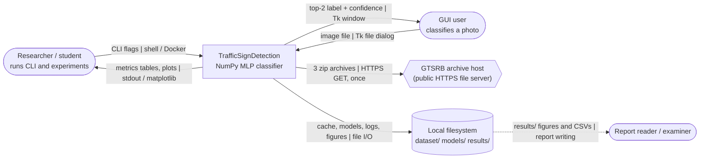
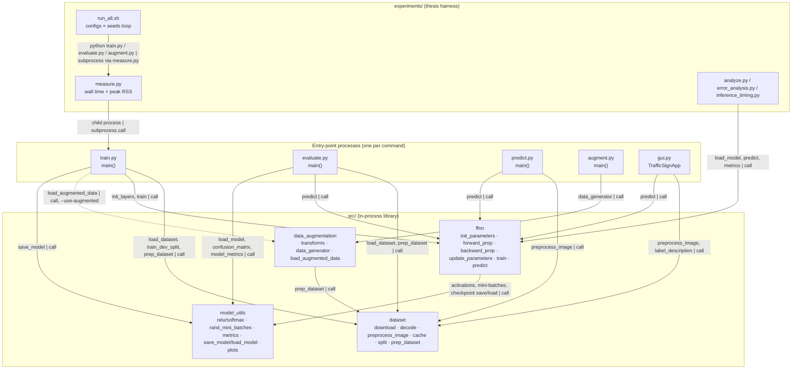
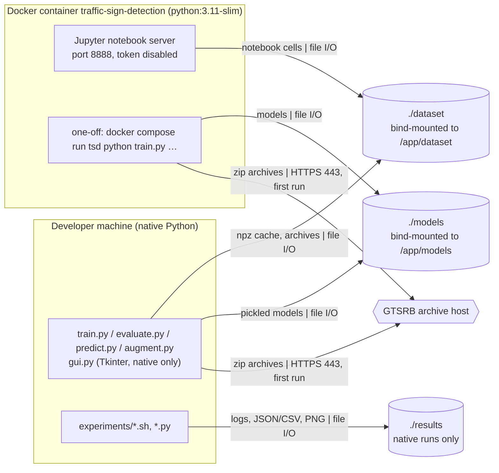

# Architecture

Generated: 2026-09-26 at commit `b11900d`, working tree including the Phase 2 fixes in `src/`, `train.py` and `augment.py`, which are not yet committed.

**Legend:** rectangles are code (module or script), rounded boxes are people, cylinders are files on disk, and
hexagons are external systems. `-->` is a synchronous in-process call or a file read/write. `-.->` is optional or
manual. Every arrow is labelled *what | how*.

Sources fingerprint: `4d3602f528b5`

**Sources**
- `src/dataset.py`, `src/ffnn.py`, `src/model_utils.py`, `src/data_augmentation.py`
- `train.py`, `evaluate.py`, `predict.py`, `augment.py`, `gui.py`
- `experiments/run_all.sh`, `experiments/analyze.py`, `experiments/measure.py`
- `Dockerfile`, `docker-compose.yml`, `requirements.txt`

## 1. System context (C4 level 1)

| element | type | responsibility | code location |
|---|---|---|---|
| Researcher / student | human actor | trains, evaluates and runs the experiment plan | `train.py`, `evaluate.py`, `experiments/run_all.sh` |
| GUI user | human actor | opens an image and gets a prediction | `gui.py:31` `TrafficSignApp` |
| Report reader / examiner | human actor | reads the results and figures, never runs code | `results/` (untracked) |
| GTSRB archive host | external system | serves the three official archives | `src/dataset.py:44` `GTSRB_URLS`, `src/dataset.py:96` |
| Local filesystem | data store | dataset cache, pickled models, experiment outputs | `src/dataset.py:40` `DATA_ROOT`, `src/model_utils.py:691` |
| TrafficSignDetection | system | preprocessing, from-scratch MLP, evaluation | `src/` |

## 2. Components (C4 levels 2–3)

Each entry script is its own short-lived process. There are no threads, no async code and no servers. The only
long-running process is the Jupyter server in the Docker image.

| element | type | responsibility | code location |
|---|---|---|---|
| `train.py` | CLI process | parse flags, load/split/prep data, build and train the network, pickle the model | `train.py:57` |
| `evaluate.py` | CLI process | test-set metrics, confusion matrix, optional plots | `evaluate.py:33` |
| `predict.py` | CLI process | classify image files given on the command line | `predict.py:36` |
| `augment.py` | CLI process | write augmented training batches for the same split | `augment.py:41` |
| `gui.py` | Tk desktop process | file dialog, preprocessing preview, top-2 prediction | `gui.py:31` |
| `dataset` | module | archive download/extract, `.ppm` decode, preprocessing, npz cache, track-aware split, float32 prep | `src/dataset.py:74`, `:181`, `:312`, `:376`, `:529` |
| `ffnn` | module | network maths, Adam, training loop with early stopping and step decay, prediction | `src/ffnn.py:229`, `:499`, `:588`, `:717`, `:905` |
| `model_utils` | module | activations, mini-batching, metrics, plots, pickle persistence | `src/model_utils.py:118`, `:205`, `:489`, `:691` |
| `data_augmentation` | module | rotate/shift/blur/zoom/crop transforms, batch generator, batch files | `src/data_augmentation.py:261`, `:399`, `:371` |
| `run_all.sh` | shell harness | runs every configuration for every seed and skips runs that are already done | `experiments/run_all.sh` |
| `measure.py` | wrapper | runs a child command and records wall time and peak RSS | `experiments/measure.py:3` |
| `analyze.py` | analysis | aggregate over seeds, McNemar/Welch tests, figures | `experiments/analyze.py` |
| `speed_benchmark.sh`, `step_times.py`, `check_ftz_equivalence.py` | analysis | old-vs-new timing, per-epoch step times, flush equivalence (not drawn) | `experiments/` |

## 3. Deployment view

| element | type | responsibility | code location |
|---|---|---|---|
| Developer machine | host | native runs, the GUI and the experiment harness | `README.md`, `SETUP.md` |
| Docker container | container | reproducible headless runtime. Default command is Jupyter | `Dockerfile` (`CMD`, `EXPOSE 8888`) |
| `./dataset`, `./models` | bind mounts | persist the dataset and models across container rebuilds | `docker-compose.yml` `volumes` |
| `./results` | directory | experiment outputs, written by native runs | `experiments/analyze.py` |
| Port 8888 | network port | Jupyter UI, published to the host | `docker-compose.yml` `ports` |
