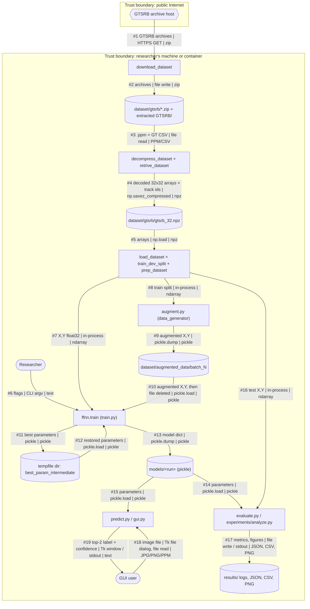
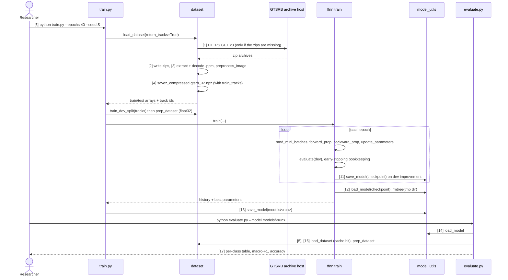
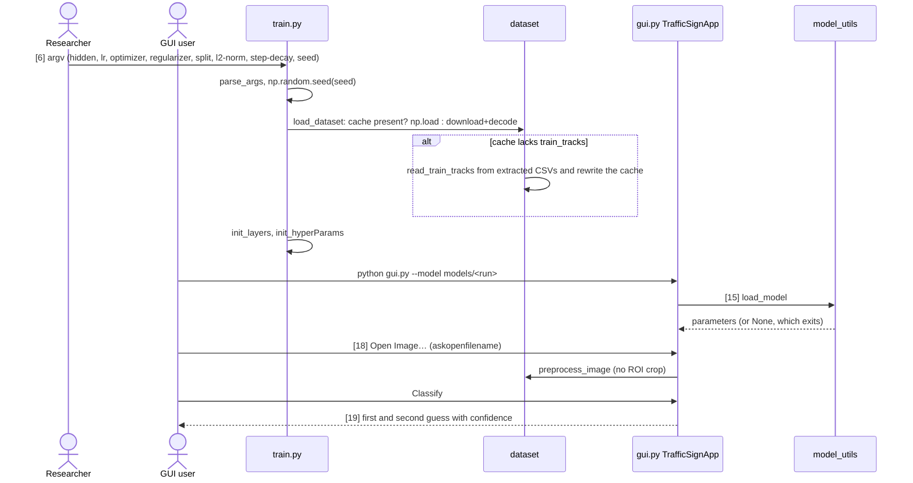
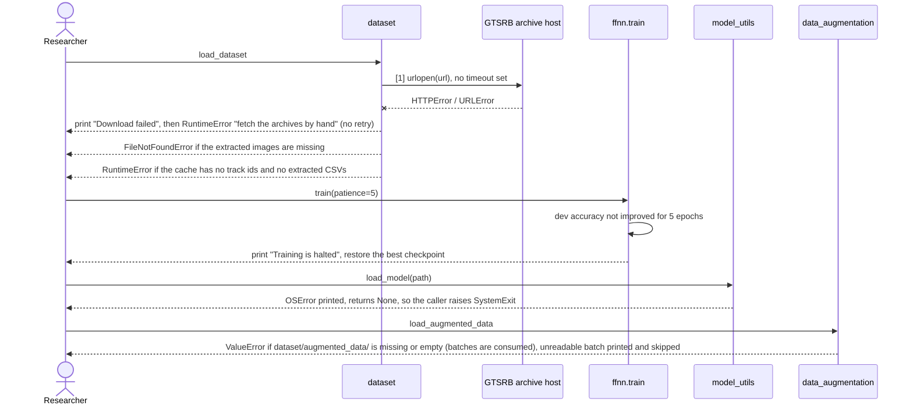

# Data flow

Generated: 2026-09-26 at commit `b11900d`, working tree including the Phase 2 fixes, which are not yet committed.

**Legend:** rounded boxes are people, hexagons are external systems, rectangles are processes (functions or
scripts), and cylinders are data stores. Arrows are labelled `#n data | protocol | format`, and `#n` (or `[n]` in sequence diagrams) is the row in the flow inventory. Dashed subgraph borders are trust boundaries.

Sources fingerprint: `9ed6321bc61b`

**Sources**
- `src/dataset.py` (download, extract, decode, cache, split, prep)
- `src/ffnn.py` (train loop, checkpoint)
- `src/model_utils.py` (save_model / load_model)
- `src/data_augmentation.py` (augmented batch files)
- `train.py`, `evaluate.py`, `predict.py`, `gui.py`, `augment.py`
- `experiments/run_all.sh`, `experiments/analyze.py`, `experiments/measure.py`
- `Dockerfile`, `docker-compose.yml`

## 1. Data-flow diagram with trust boundaries

The one crossing into the public Internet is **#1**, with no authentication and no checksum. Every other flow stays on
the machine. The pickle reads (#10, #12, #14, #15) trust the file's origin. A model file from elsewhere is effectively
code.

## 2. Sequences

### a) Main path: first run, from source archives to a trained and evaluated model

### b) Configuration and start-up (CLI and GUI)

### c) Errors and retries

There is no retry anywhere in the code. Each failure below is printed and then either raised or skipped.

## 3. Flow inventory

| # | source | destination | data | protocol/port | auth | sync/async | file:line |
|---|---|---|---|---|---|---|---|
| 1 | GTSRB archive host | `download_dataset` | 3 zip archives (~280 MB) | HTTPS 443, `urlopen` | none, no checksum | sync | `src/dataset.py:96` |
| 2 | `download_dataset` | `dataset/gtsrb/*.zip` | archive bytes | file write | fs perms | sync | `src/dataset.py:101` |
| 3 | zips / extracted `GTSRB/` | `decompress_dataset`, `retrive_dataset` | `.ppm` images + `GT-*.csv` | `zipfile`, file read | fs perms | sync | `src/dataset.py:138`, `src/dataset.py:252` |
| 4 | `retrive_dataset` / `load_dataset` | `gtsrb_32.npz` | uint8 32×32 arrays, labels, track ids | `np.savez_compressed` | fs perms | sync | `src/dataset.py:361` |
| 5 | `gtsrb_32.npz` | `load_dataset` | cached arrays | `np.load` (no pickle) | fs perms | sync | `src/dataset.py:339` |
| 6 | Researcher | `train.py` | hyper-parameters, seed, split | CLI argv | local user | sync | `train.py:22` |
| 7 | `load_dataset` → `prep_dataset` | `ffnn.train` | X `(1024,m)` float32, Y `(43,m)` | in-process | — | sync | `train.py:62`, `train.py:75`, `train.py:101` |
| 8 | `load_dataset` + `train_dev_split` | `augment.py` | training split (same seed and split) | in-process | — | sync | `augment.py:45`, `augment.py:48` |
| 9 | `data_generator` | `dataset/augmented_data/batch_N` | augmented float32 X,Y | `pickle.dump` | fs perms | sync | `src/data_augmentation.py:369` |
| 10 | `dataset/augmented_data/` | `train.py` | augmented X,Y. **The file is deleted after reading** | `pickle.load`, `os.remove` | trusts file | sync | `src/data_augmentation.py:387`, `src/data_augmentation.py:391` |
| 11 | `ffnn.train` | tempfile checkpoint | best-so-far parameters | `save_model` (pickle) | fs perms | sync | `src/ffnn.py:875` |
| 12 | tempfile checkpoint | `ffnn.train` | restored parameters, then the dir is removed | `load_model`, `shutil.rmtree` | trusts file | sync | `src/ffnn.py:891`, `src/ffnn.py:892` |
| 13 | `train.py` | `models/<run>` | model dict (parameters, layers, hyper-params, seed, split, history) | `pickle.dump` | fs perms | sync | `train.py:135`, `src/model_utils.py:702` |
| 14 | `models/<run>` | `evaluate.py`, `experiments/analyze.py` | parameters | `pickle.load` | **trusts file** | sync | `evaluate.py:37`, `src/model_utils.py:720` |
| 15 | `models/<run>` | `predict.py`, `gui.py` | parameters | `pickle.load` | **trusts file** | sync | `predict.py:39`, `gui.py:33` |
| 16 | `load_dataset` | `evaluate.py` / `analyze.py` | test X,Y | in-process | — | sync | `evaluate.py:42` |
| 17 | `evaluate.py` / `experiments/*.py` | stdout / `results/` | metrics tables, JSON, CSV, PNG | stdout, file write | fs perms | sync | `evaluate.py:47`, `experiments/analyze.py:109` |
| 18 | GUI user / CLI args | `gui.py` / `predict.py` | image file | Tk file dialog, `Image.open` | local user | sync | `gui.py:91`, `gui.py:100`, `predict.py:24` |
| 19 | `gui.py` / `predict.py` | GUI user / stdout | top-2 labels + confidence | Tk labels / print | — | sync | `gui.py:114` |
| 20 | `GT-final_test.csv` (test ROI boxes) | `experiments/error_analysis.py` | test-set ROI sizes for error slicing | file read | fs perms | sync | `experiments/error_analysis.py:16` |

Not drawn above, because each is local and one-off:
- `experiments/run_all.sh` → `measure.py` → child `python` process (`subprocess.call`, `experiments/measure.py:3`).
- `plt.show()` windows (`src/model_utils.py:307`, `src/model_utils.py:604`, `src/dataset.py:466`, `src/dataset.py:489`).
- The per-transform JPEG dumps when `save_image=True` (`src/data_augmentation.py:59` and siblings; off by default).
- The Docker Jupyter UI on port 8888 (`Dockerfile`).
- Archive deletion after extraction, only if `decompress_dataset(keep_original=False)` is called (`src/dataset.py:139`). No caller does this.
- `load_images_from_file` (`src/data_augmentation.py:475`) reads a folder of images. It is defined but no script calls it.
- Row 20 is not drawn in the DFD. It is an analysis-only read.
- `experiments/speed_benchmark.sh` reads the original sources with read-only `git show <rev>:<file>` into a `mktemp -d` directory, symlinks `dataset/`, trains both versions and writes `results/speed_benchmark.json`.
- `experiments/step_times.py` parses `results/logs/*.train.log`. `experiments/check_ftz_equivalence.py` retrains E0 seed 1 in a temp directory and compares it with `models/e0_baseline_s1`.

## 4. State and data stores

| store | written by | read by | lifetime / notes |
|---|---|---|---|
| `dataset/gtsrb/*.zip`, `GTSRB/` | `download_dataset`, `decompress_dataset` | `retrive_dataset`, `read_train_tracks` | persistent. Zips are kept (`keep_original=True`) |
| `dataset/gtsrb/gtsrb_32.npz` | `load_dataset` (`src/dataset.py:361`) | `load_dataset` (`src/dataset.py:339`) | persistent cache (~49 MB). An old cache without `train_tracks` is rewritten in place (`src/dataset.py:351`) |
| `dataset/augmented_data/batch_N` | `data_generator` → `save_generated_data` | `load_augmented_data` | **consumed**: each file is deleted once loaded |
| tempfile `tsd_train_*/best_param_intermediate` | `ffnn.train` | `ffnn.train` | per run, always removed (`src/ffnn.py:892`) |
| `models/<run>` | `train.py` | `evaluate.py`, `predict.py`, `gui.py`, `experiments/*.py` | persistent pickle. Float32 parameters (~2.7 MB for the baseline) |
| `results/logs/*.log`, `*.time.json` | `experiments/run_all.sh`, `measure.py` | `experiments/analyze.py` | persistent |
| `results/*.json`, `*.csv`, `predictions/`, `figures/` | `experiments/analyze.py`, `error_analysis.py`, `inference_timing.py` | report author | persistent. Regenerated on every analysis run |
| `temp/best_param_intermediate` | the original code only | nothing | stale leftover. The current code uses `tempfile` |
